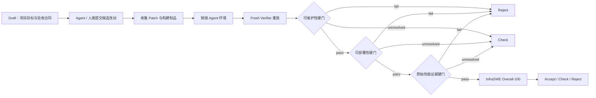

# InfraSWE 项目说明

> 面向 AI 基础设施 Agent、GPU Kernel、训练/推理后端和分布式系统改动的可执行评测与决策框架。

## 一句话介绍

InfraSWE 不只检查 Agent 是否生成了一个“看起来合理”的补丁，而是把候选改动作为独立制品收集，在全新的验证环境中重新应用，并通过正确性、性能、并发、故障恢复、资源、证据完整性和项目适配性检查，最终给出可复现、可审计的评分与决策。

项目当前 Python 包版本为 `0.1.0`，要求 Python 3.12，采用 Apache-2.0 许可证。

## 为什么需要 InfraSWE

普通软件评测通常以“测试是否通过”为终点，但 AI 基础设施改动还面临一些特殊问题：

- Kernel 在一个 shape 或一张 GPU 上更快，不代表在完整 workload 中稳定。
- 单元测试通过，不代表没有 silent fallback、资源泄漏、并发退化或故障恢复问题。
- 不同硬件、驱动、编译器和 runtime 上的绝对延迟不能直接混排。
- 缺少证据和实际失败不是一回事，不能都记成零分。
- 一个实现技术上正确，也不一定符合目标项目的接口、生命周期、构建和维护习惯。
- Agent 自报的运行结果不能代替验证方在新环境中的独立重放。

InfraSWE 的目标是把这些问题变成冻结的合同、可执行探针、分层证据和明确的状态机。

## 核心工作流



一个典型任务会经历以下阶段：

1. 冻结目标项目、基础 revision、语义合同、验收合同、测试集、workload 和硬件 Cell。
2. Agent 在看不到隐藏测试与可信解法的环境中修改代码。
3. Runner 只收集声明允许的 Patch、源码或构建制品。
4. Agent 环境被销毁，候选制品被应用到新的 verifier 环境。
5. 多个 fresh process 执行正确性、性能、并发、故障和证据探针。
6. InfraCert 先判断候选是否具备评分资格。
7. 评分器分别产生可部署性、同 Cell 性能效率和项目适配结果。
8. 决策器输出结论、适用范围、排除范围、失败代码和下一步动作。

## 核心概念

### 协议版本关系

仓库中的版本号描述不同协议层，并非互相覆盖的软件发行版：

| 协议层 | 主要用途 |
|---|---|
| v0.1 | Runner、Task Package 和原始基础设施评测核心 |
| v0.3 | Kernel Frontier、AnchorScore 与硬件 Cell 校准实验 |
| v0.4 | 当前正式的 InfraCert、Deployability 和 CellArtifact 评分边界 |
| v0.5 | 独立的 Draft、ProjectFit、BenchmarkTrust、Cost 与合并决策层 |

v0.5 不会重写已有 v0.4 分数；它回答的是候选是否符合一个具体目标项目，而不是重新定义底层可部署性。

### Task Package

Task Package 是可执行任务合同，包含：

- 目标仓库与基础 commit；
- Agent 和 verifier 的隔离环境；
- 允许修改的文件范围；
- 资源与成本预算；
- fresh replay 数量；
- 正确性、安全、fallback、资源和故障门禁；
- 评分公式、workload、证据要求与硬件需求。

### Benchmark Cell

一个 Cell 固定硬件、驱动、runtime、编译器、框架版本、workload 和校准参数。同一个源码在不同 Cell 中可以有不同的性能结果。

绝对延迟和 CellArtifact 禁止跨 Cell 排名；只有经过归一化且合同一致的分数才允许在声明范围内比较。

### Evidence Ladder

InfraSWE 使用分层证据：

| 等级 | 含义 |
|---|---|
| `E0-runtime` | 程序实际执行证据 |
| `E1-framework` | 框架级 trace/profiler 证据 |
| `E2-system-trace` | 系统时间线与并发行为证据 |
| `E3-kernel-counter` | Kernel counter、物理流量和硬件效率证据 |
| `E4-sealed` | 已封存、身份完整且可独立复核的正式证据 |

缺少所需等级时，结果是 `unresolved`，而不是自动记零。

### Draft 与 Seal

v0.5 Draft 描述“这个项目真正希望接受什么”，包括项目边界、接口、生命周期、fallback、部署 workload、性能目标和维护探针。

Draft 可以来自：

```text
local > remote Git > built-in default
```

默认 Draft 是机器提出的起点，不代表项目维护者已经认可。正式 ProjectFit 之前必须经过项目维护者 review 并 Seal，Seal 后不能静默改变合同或候选身份。

## 评分体系

InfraSWE 将“能不能评分”“分数是多少”“能不能合并”分开处理。当前正式结果只对外发出
一个顶层综合分 `overall_score_100`；ProjectFit 与 BenchmarkTrust 作为其下并列的
解释性 microscore，不再与综合分处于同一层级。

### 1. InfraCert：硬门

InfraCert 关注候选是否具备进入正式评分的资格，例如：

- 隐藏正确性是否全部通过；
- 是否存在 silent fallback 或数据损坏；
- native 路径、源码、构建制品与运行证据能否绑定；
- fresh replay 是否完整且身份一致；
- 是否出现死锁、资源泄漏、无界队列或恢复失败；
- 必需的测试、manifest 和安全策略是否满足。

InfraCert 的状态为：

| 状态 | 含义 |
|---|---|
| `pass` | 硬门通过，可以继续正式评分 |
| `fail` | 已有充分证据证明违反合同 |
| `unresolved` | 证据不足或验证基础设施无法完成判断 |
| `not_applicable` | 当前任务或硬件不适用 |

### 2. Deployability-100：全局可部署性

当前 v0.4 正式公式为：

$$
\text{Deployability-100}
=100\times C^{0.45}\times U^{0.30}\times M^{0.25}
$$

- `C`：Concurrent Stability，并发 goodput、尾延迟、抖动、资源稳定性和公平性。
- `U`：Kernel Reuse，覆盖率、变体预算、编译复用和跨平台复用。
- `M`：Maintainability，能力合同、改动局部性、测试和构建质量。

每个维度还有硬下限：`C ≥ 0.60`、`U ≥ 0.55`、`M ≥ 0.50`。几何总分再高，只要某个维度低于下限，就会被判为 `not_deployable`，排行榜有效分为 0。

正式 Deployability 至少要求 5 次 fresh-process replay 和 `E2-system-trace`；7 次 replay 时可获得更高置信度。

### 3. CellArtifact-100：同一硬件 Cell 内的性能效率

CellArtifact 用于描述候选在当前硬件 Cell 内离校准 SOL 有多近，以及内存/链路效率和流量放大情况。根据 workload 可选择 mixed、memory-bound、compute-bound 或 distributed 模板。

它通常需要 `E3-kernel-counter`，并明确禁止跨 Cell 排名。因而可能出现：Deployability 已有正式分，但 CellArtifact 因 counter 证据不足仍为 `unresolved`。

### 4. ProjectFit-100：对目标项目的适配性

普通 Kernel 的 v0.5 ProjectFit 为：

$$
\text{ProjectFit-100}
=100\times EM^{0.40}\times CF^{0.30}\times RU^{0.20}\times OF^{0.10}
$$

| 维度 | 含义 | 下限 |
|---|---|---:|
| `EM` | 演进可维护性 | 0.60 |
| `CF` | 项目合同适配 | 0.60 |
| `RU` | 性能、复用与利用率 | 0.40 |
| `OF` | replay、负载、资源及 cold/steady 运行适配 | 0.60 |

Pure Triton 模板会额外加入 20% 的可移植性维度，并审计是否存在隐藏 native kernel、后端逻辑泄漏或不合法的跨硬件绝对排名。

ProjectFit 只能在完全相同的 ProjectComparisonCell 内比较，禁止拿不同项目的 ProjectFit 声称“谁普遍更好”。

正式 ProjectFit 还要求：

- InfraCert 通过；
- Draft 已完成维护者 review 和 Seal；
- 至少 5 次 fresh replay；
- 至少 E2 证据；
- hidden probes 完成；
- evidence manifest 验证通过；
- 所有必需维度都有正式数值并通过下限。

### 5. BenchmarkTrust、BenchmarkCost 与唯一综合分

BenchmarkTrust 独立记录复现性、证据、统计方法和环境可信度；BenchmarkCost 记录墙钟时间、加速器时间、编译/预编译、冷启动、稳态、profiler 和 cache 成本。

ProjectFit 与 BenchmarkTrust 是 `microscores` 下的同级子分，分别回答“候选是否适合
项目”和“结果是否可信”；BenchmarkCost 只是成本卡，不是分数。前三道流程硬门全部
通过后，唯一综合分按冻结公式计算：

$$
\text{InfraSWE Overall-100}
=100\times (\text{ProjectFit}/100)^{0.85}
\times (\text{BenchmarkTrust}/100)^{0.15}
$$

综合分不会与 ProjectFit、BenchmarkTrust 并列输出；两项子分只嵌套在
`microscores` 中，用于解释和审计。

## 决策语义

默认使用 InfraSWE 完整评估并开启 Seal；显式诊断/外部评估仍可选择其他模式，但不能冒充
official sealed 结果。三分类严格按以下顺序执行：

1. 检查演进可维护性；
2. 检查 InfraCert、项目合同与运行适配构成的可部署性；
3. 检查原始性能/复用/利用率证据及适用的 release gate；
4. 只有前三道硬门全部通过，才计算并使用 `overall_score_100`。

任一道硬门 `fail` 都直接归入 `reject`，其后步骤标记为 `not-run`；证据未决则归入
`check`，不能由后续高分补偿。全门通过后的总分映射固定为：

| 决策 | 含义 |
|---|---|
| `accept` | 全部硬门通过且综合分 > 65 |
| `check` | 硬门证据未决，或综合分位于 50–65（含两个边界） |
| `reject` | 任一硬门失败，或综合分 < 50 |

`accept_with_scope` 只是 `accept` 三分类下的范围限定符，不构成第四类。Draft Seal、证据
等级和身份绑定仍是正式结果的前提；综合分不能绕过硬失败或把缺证据改写成 accept。

历史 PR 校准与正式 sealed ProjectFit 必须分开。R8 已证明 coarse static 特征配合强制极化会把不同候选压成相同高分；因此通用历史评测默认恢复 R4 ordered case-contract，不产生伪造的 0–100 分。R5 polarized 只作为既有锁的显式兼容/负对照模式。R9 五项补测采用逐案例 base/head probe，并在机器锁之后才读取 outcome。

## 已实现能力

当前仓库已包含：

- 17 个可执行 Task Package，覆盖构建与打包、部署配置、推理性能、可观测性、可靠性、分布式通信和训练；
- local、Docker、VM、Kubernetes 执行器抽象；
- fresh verifier replay、Patch/制品收集、失败重试和资源租约模型；
- Kernel Frontier 的校准 Anchor、配对计时、bootstrap 置信区间和负控；
- NVIDIA SM80、SM89、SM90、SM100、SM120/SM121 及 AMD gfx942 等不同成熟度的硬件适配实验；
- 跨框架训练语义、checkpoint/RNG、分布式、fallback 和资源安全检查；
- vLLM、SGLang、FlashAttention、FlashInfer、CUTLASS/CuTe、Liger-Kernel、DeepGEMM、Megatron-Core、TorchTitan、verl 十个默认项目 Draft；
- 39 项分角色默认候选和 13 条确定性 first-match 规则；
- 历史 PR 盲测与可解释启发式规则，用于校准 Agent 的工程判断；
- Pydantic 模型、JSON Schema、CLI、pytest 与 Ruff 回归体系。
- v0.1 Task 三元契约与 verifier qualification、artifact/evidence 可信运输、capability/resource/topology/cell reference controller；尚未冒充生产调度或隔离执行面。

默认候选的选择是确定性的元数据操作，不使用学习模型或隐式权重，选择阶段不会 import 或编译候选。只有显式激活的一个 peer implementation 可以在正式计时前进入预编译阶段。

## 仓库结构

```text
infraswe/
├── src/infraswe/       # 协议模型、Runner、Verifier、评分、Draft、环境和遥测
├── tasks/              # 可执行任务包
├── benchmarks/         # Kernel、训练、硬件、历史 PR 与用户 Kernel 实验
├── platforms/          # 硬件平台合同与适配器
├── catalog/            # 默认 Draft 与默认候选目录
├── schemas/            # 版本化 JSON Schema
├── tests/              # 单元与协议回归测试
├── results/            # 已归档的评分、证据和报告
└── runs/               # 本地或远端执行产生的运行目录
```

## 快速开始

安装依赖：

```bash
uv sync --extra dev
```

验证一个任务包：

```bash
env PYTHONPATH=src uv run infraswe task validate \
  tasks/gpu-service-rollout-regression
```

使用 Docker 做隔离认证：

```bash
env PYTHONPATH=src uv run infraswe task certify \
  tasks/gpu-service-rollout-regression \
  --executor docker
```

生成运行报告：

```bash
env PYTHONPATH=src uv run infraswe report runs/<run-id>
```

检查训练能力或生成默认 Draft：

```bash
env PYTHONPATH=src uv run infraswe training probe \
  --output training-capabilities.json
env PYTHONPATH=src uv run infraswe draft defaults \
  --output catalog/default-drafts-v0.5
env PYTHONPATH=src uv run infraswe draft candidates \
  --output catalog/default-candidates-v0.5
```

运行基础回归：

```bash
env PYTHONPATH=src uv run ruff check .
env PYTHONPATH=src uv run pytest -q
env PYTHONPATH=src uv run python -m infraswe schema check --output schemas
```

## 如何阅读一次结果

建议按以下顺序阅读，而不是先看最高分：

1. 确认目标项目、candidate digest、baseline 和 ProjectComparisonCell。
2. 查看 InfraCert 是 `pass`、`fail` 还是 `unresolved`。
3. 查看 evidence grade、fresh replay 数和 manifest 状态。
4. 区分 diagnostic/provisional 分与 official 分。
5. 检查每个维度是否通过 floor。
6. 查看 supported scope、excluded scope 和 required actions。
7. 最后再比较同一合法 Cell 内的数值分和置信区间。

## 当前边界

- 本地 executor 用于开发与调试，不是安全隔离；发布级认证应使用 Docker 或更强隔离。
- 一些硬件适配器和 feature score pack 仍是实验或诊断性质，不能代替 v0.4 正式评分。
- 不同硬件 Cell 的绝对性能不能直接混排。
- 默认 Draft 属于 machine-proposed，正式使用前需要项目维护者 review。
- 缺少 E2/E3、counter 权限或正式部署环境时，相关结果保持 `unresolved`。
- v0.5 Draft/ProjectFit 是独立版本层，不会回写或篡改既有 v0.4 分数。
- InfraSWE 是评测与决策框架，不是生产部署平台，也不替代项目维护者的最终治理权。

## 项目适合谁

- 评估代码 Agent 是否真正具备 AI 基础设施工程能力的团队；
- 开发 GPU Kernel、推理后端、训练框架和分布式运行时的工程师；
- 需要可复现硬件性能证据和失败归因的项目维护者；
- 希望把“测试通过”升级为“可部署、可维护、可审计”的基础设施团队。

## 延伸阅读

- [主 README](README.md)
- [Kernel Frontier 说明](benchmarks/kernel_frontier/README.md)
- [默认 Draft 目录](catalog/default-drafts-v0.5/README.md)
- [默认候选与预编译策略](catalog/default-candidates-v0.5/README.md)
- [训练跨框架评测](benchmarks/training_cross_framework/README.md)
- [Ada SM89 平台说明](platforms/nvidia-ada-sm89/README.md)
