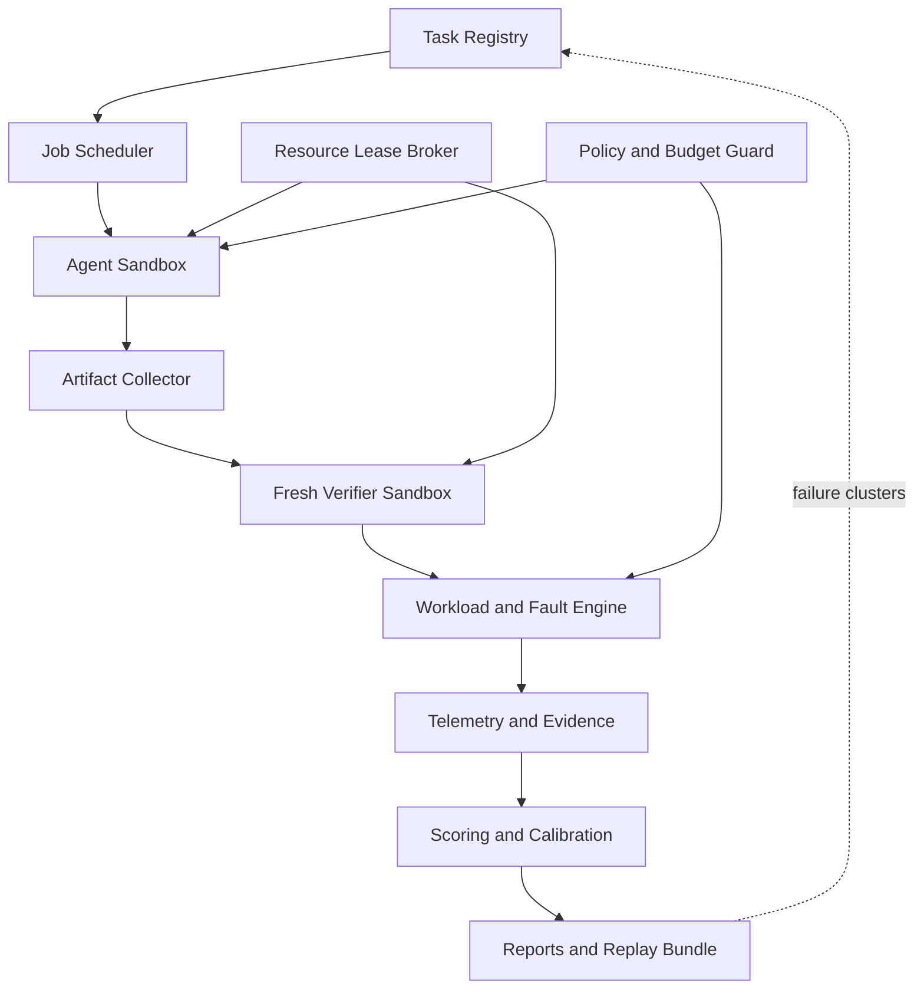
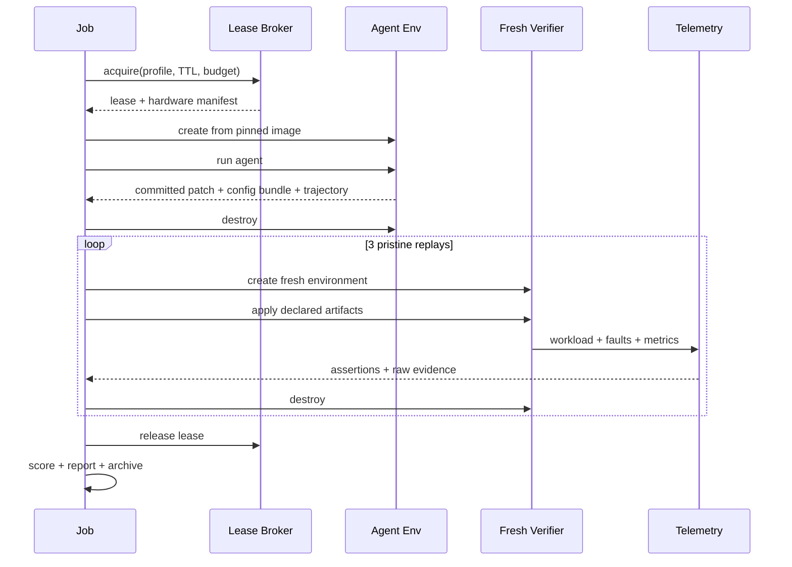
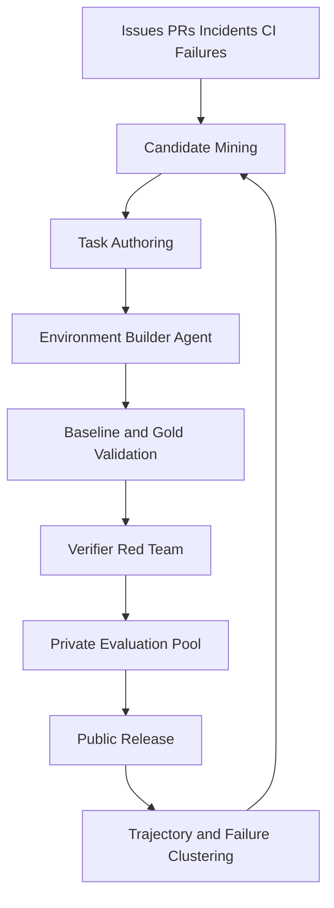

# InfraSWE v0.1：面向 AI Infrastructure Agent 的可执行 Benchmark

> 状态：Initial Design Draft  
> 日期：2026-08-31  
> 目标版本：v0.1  
> 核心定位：评测 Agent 是否能在隔离、可重放的真实基础设施中，完成代码修改、部署、性能诊断、故障恢复与安全回滚，而不只是生成一个能通过单元测试的 patch。

---

## 1. 一句话定义

**InfraSWE = SWE benchmark 的“代码修复闭环” + 可执行基础设施状态 + SLO workload + fault injection + telemetry evidence + resource/cost accounting。**

普通 SWE 任务的最终产物通常是 patch；InfraSWE 的最终产物是一个同时包含以下内容的可验证变更集：

- Git patch；
- Kubernetes、Helm、Terraform、systemd、Slurm 等声明式配置；
- 部署后的系统状态；
- workload、故障与恢复轨迹；
- logs、metrics、traces、profile、配置 diff；
- 成本、能耗、GPU/CPU/NIC 使用量；
- rollback 结果和安全审计事件。

## 2. 为什么值得做

现有代表性 SWE benchmarks 已经很好地解决了代码任务的收集、容器复现、patch 应用和测试判定：

- [DeepSWE](https://github.com/datacurve-ai/deep-swe) 使用原创长程任务、行为型 verifier 和独立验证环境；
- [Pier](https://github.com/datacurve-ai/pier) 提供 Agent/环境适配、artifact collect、独立 verifier 与轨迹记录；
- [SWE-bench](https://github.com/swe-bench/SWE-bench) 奠定了 `FAIL_TO_PASS + PASS_TO_PASS` 和实例镜像协议；
- [SWE-bench Pro](https://github.com/scaleapi/SWE-bench_Pro-os) 强化长程任务与实例级运行脚本；
- [SWE-rebench V2](https://github.com/SWE-rebench/SWE-rebench-V2) 探索自动环境重建和多语言扩展；
- [SWE-bench Live](https://github.com/microsoft/SWE-bench-Live) 强化持续更新、多 OS 和重复验证；
- [Multi-SWE-bench](https://github.com/multi-swe-bench/multi-swe-bench) 使用 repo/language adapter 扩展多语言任务。

但 AI Infra 的完成条件通常不等同于“测试通过”：

- 服务能启动，不代表 P99、TPOT、error rate 和 goodput 达标；
- NCCL 不报错，不代表没有 silent fallback、跨 NUMA 退化或 GDR 未启用；
- Pod Ready，不代表 rollout、流量切换和回滚安全；
- 一次通过，不代表同一变更能在 fresh cluster 稳定重放；
- nsys/ncu 图看起来合理，不代表性能提升来自声称的机制；
- 吞吐增加，不代表没有数据破坏、错误结果、饥饿或公平性恶化。

InfraSWE 的空间正是把这些系统性质变成程序化、可审计的 oracle。

## 3. v0.1 的边界

### 3.1 v0.1 要完成

1. Harbor/Pier 风格的任务包和独立 verifier；
2. CPU、单 GPU、单节点 4 GPU 三档环境；
3. patch、配置和部署状态的统一 artifact 协议；
4. workload、fault、telemetry、score 的统一生命周期；
5. 与 DeepSWE/SWE-bench 家族横向兼容的 `SWE-Core` 分数；
6. InfraSWE 专属的 SLO、恢复、安全、资源和证据分数；
7. GPU lease、TTL 和预算保护；
8. 16 个可发布任务，以及 noop/oracle/至少两个真实 Agent baseline。

### 3.2 v0.1 不做

- 不做覆盖所有云厂商的生产级多云控制面；
- 不把 nsys/ncu 单张截图当作 verifier；
- 不对不同 GPU 的绝对吞吐直接混榜；
- 不允许 Agent 操作不可恢复的真实生产集群；
- 不在 v0.1 日常 CI 中运行昂贵的多节点 H100/H200/B200；
- 不以参考 patch 的文本相似度评分；
- 不把缺失指标补成 0 后强行制造一个总榜。

## 4. 设计原则

1. **行为优先**：oracle 验证可观察行为，不匹配内部实现。
2. **Agent 与 verifier 分离**：Agent 永远看不到 hidden tests、gold patch 和评分阈值的实现细节。
3. **artifact-only crossing**：Agent 环境与 verifier 环境之间只传递明确声明的 artifact。
4. **fresh replay**：同一变更集至少在 3 个 fresh verifier 环境中重放。
5. **拓扑是一等输入**：GPU、NUMA、PCIe/NVLink、NIC、RDMA、OS 和驱动版本进入硬件清单。
6. **SLO 先于峰值**：用 SLO-compliant goodput，而不是单一 peak throughput。
7. **灾难性失败硬门控**：数据破坏、安全越界、失控 blast radius、无界死锁和 silent fallback 不能被其他高分抵消。
8. **证据可追溯**：所有得分都能回到原始日志、指标、trace、profile 或状态快照。
9. **成本进入协议**：GPU 分钟、token、wall time、功耗和失败重试都有预算。
10. **横向分与系统分分离**：共同 SWE 能力和 Infra 专属能力分别报告。

## 5. 总体架构



### 5.1 控制面与数据面

| 平面 | 责任 | 默认实现 |
|---|---|---|
| Control plane | 排队、预算、Agent API、TTL、重试、provider lease | Python async runner |
| Agent data plane | Agent 编辑、运行命令、提交变更 | Docker/VM/K8s namespace |
| Verifier data plane | 应用 artifact、运行 workload/fault、隐藏 oracle | 独立 Docker/VM/K8s namespace |
| Evidence plane | logs、metrics、traces、profiles、events、config diff | JSONL + OpenTelemetry + 原生文件 |
| Score plane | Core/Infra 指标、门控、置信区间、校准 | Python scoring library |

Agent 的模型 API 可以通过显式 allowlist 出网；任务环境、依赖、测试与服务本身默认无公网。

## 6. 技术栈与语言选择

### 6.1 v0.1 决策

- **Python 3.12**：runner、task SDK、verifier SDK、scoring、provider adapter、CLI；
- **TOML + JSON Schema/Pydantic**：任务和运行协议；
- **Bash**：仅作为任务 entrypoint，不承载评分逻辑；
- **OpenTelemetry + Prometheus exposition**：跨任务 telemetry 协议；
- **Pytest**：SDK 自测，不规定任务必须使用 Pytest；
- **Docker/OCI**：基础隔离格式；
- **Kubernetes/k3s**：部署与恢复类任务；
- **Git commit/diff**：代码变更的唯一 canonical artifact。

### 6.2 暂缓的语言

- **Go sidecar**：v0.2 再引入，用于 client-go watcher、长期运行的 fault/lease daemon；
- **Rust daemon**：只有当 trace ingestion、sandbox IPC 或高并发事件流成为实际瓶颈时再引入；
- v0.1 不同时维护 Python、Go、Rust 三套核心协议。

这一选择能最快复用 Harbor/Pier、SWE-bench harness、Kubernetes Python client、Prometheus 和数据分析生态，同时避免初版被多语言工程量拖死。

## 7. 建议源码目录

```text
infraswe/
├── pyproject.toml
├── README.md
├── LICENSE
├── src/infraswe/
│   ├── cli.py
│   ├── job.py
│   ├── models/
│   │   ├── task.py
│   │   ├── trial.py
│   │   ├── artifact.py
│   │   └── score.py
│   ├── runner/
│   │   ├── trial.py
│   │   ├── queue.py
│   │   ├── lifecycle.py
│   │   └── retry.py
│   ├── agents/
│   │   ├── base.py
│   │   ├── cli_agent.py
│   │   ├── noop.py
│   │   └── oracle.py
│   ├── environments/
│   │   ├── docker.py
│   │   ├── vm.py
│   │   ├── kubernetes.py
│   │   └── hardware_manifest.py
│   ├── lease/
│   │   ├── broker.py
│   │   ├── budget.py
│   │   └── providers/
│   ├── verifier/
│   │   ├── verifier.py
│   │   ├── replay.py
│   │   ├── workload.py
│   │   ├── faults.py
│   │   └── policy.py
│   ├── telemetry/
│   │   ├── collector.py
│   │   ├── prometheus.py
│   │   ├── otel.py
│   │   └── profiler.py
│   ├── scoring/
│   │   ├── core.py
│   │   ├── infra.py
│   │   ├── gates.py
│   │   └── report.py
│   └── calibration/
│       ├── anchors.py
│       ├── irt.py
│       └── bootstrap.py
├── schemas/
│   ├── task.schema.json
│   ├── artifact.schema.json
│   └── result.schema.json
├── tasks/
├── profiles/
│   ├── cpu-small.toml
│   ├── gpu-1x-sm80.toml
│   ├── gpu-4x-sm80-pcie.toml
│   ├── gpu-4x-sm80-nvlink.toml
│   └── gpu-2n4g-rdma.toml
├── images/
├── scripts/
└── tests/
```

## 8. Task Package

```text
tasks/<task-id>/
├── task.toml
├── instruction.md
├── environment/
│   ├── agent.Dockerfile
│   ├── verifier.Dockerfile
│   ├── cluster.yaml
│   └── lock/
├── workload/
│   ├── workload.yaml
│   └── client.py
├── faults/
│   ├── scenarios.yaml
│   └── inject.py
├── tests/
│   ├── verify.py
│   ├── assertions.yaml
│   └── slo.yaml
└── solution/
    ├── solution.patch
    └── solve.sh
```

`tests/` 和 `solution/` 只存在于 verifier 侧。参考解只用于 task author 的离线 spot-check，不参与正式评分。

### 8.1 `task.toml` 最小示例

```toml
schema_version = "0.1"

[task]
id = "nccl-topology-silent-fallback"
track = "distributed-runtime"
repository = "example/runtime"
base_commit = "<sha>"

[environment]
profile = "gpu-4x-sm80-nvlink"
agent_mode = "vm"
verifier_mode = "separate"
network = "allowlist"

[budget]
agent_timeout_sec = 7200
verifier_timeout_sec = 2400
gpu_minutes = 360
max_model_cost_usd = 30

[replay]
count = 3
require_all = true

[artifacts]
paths = [
  "/logs/artifacts/model.patch",
  "/logs/artifacts/config-bundle.tar.zst",
  "/logs/artifacts/trajectory.jsonl"
]

[gates]
forbid_test_modification = true
forbid_credential_access = true
forbid_silent_fallback = true
forbid_data_corruption = true
```

## 9. Trial 生命周期



### 9.1 状态机

```text
PENDING
  -> LEASING
  -> SETUP
  -> AGENT_RUNNING
  -> COLLECTING
  -> AGENT_DESTROYED
  -> VERIFYING_1..3
  -> SCORING
  -> ARCHIVING
  -> COMPLETED | FAILED_INFRA | FAILED_AGENT | INVALID_TASK | BUDGET_EXCEEDED
```

每个状态必须幂等；恢复时只允许从持久化 checkpoint 继续，不能依靠仍存活的 shell session。

## 10. v0.1 任务组成

建议首发 **16 个任务**，先把质量和复现做深，不追求任务数量：

| Track | 数量 | 硬件 | 例子 |
|---|---:|---|---|
| Build & packaging | 3 | CPU / 1 GPU | CUDA extension 构建、ABI/driver capability 判定、镜像依赖修复 |
| Deploy & configuration | 3 | CPU / 1 GPU | Helm rollout、GPU resource request、service/health probe 修复 |
| Inference performance | 4 | 1 GPU / 4 GPU | batch/并发配置、KV cache、TP/PP 参数、NUMA/CPU affinity 退化 |
| Distributed communication | 3 | 4 GPU | NCCL 拓扑选择、rank 分歧死锁、collective/compute overlap 回归 |
| Reliability & recovery | 2 | CPU / 4 GPU | OOM/进程退出、节点/网络扰动后的恢复和回滚 |
| Observability & diagnosis | 1 | 4 GPU | 依据 logs/metrics/traces/profile 找到机制根因并给出可验证修复 |

另外保留 2 个 `experimental-multinode` 任务，但不计入 v0.1 默认榜。

### 10.1 任务难度层级

- **L1**：单组件、公开日志、明确复现命令；
- **L2**：跨组件、需要部署和 workload 验证；
- **L3**：多 GPU、存在性能/正确性 trade-off；
- **L4**：多节点、故障注入、需要恢复和机制证据。

## 11. Verifier 设计

### 11.1 三类 oracle

1. **Functional oracle**：目标功能、接口和状态正确；
2. **System oracle**：SLO、恢复、安全、资源和拓扑行为正确；
3. **Protocol oracle**：无越权、无测试篡改、artifact 完整、环境可重放。

### 11.2 标准验证顺序

1. 校验 task image、repo SHA、hardware manifest 和 workload digest；
2. base 环境必须触发目标失败；
3. gold solution 在 3 个 fresh 环境中全部通过；
4. 运行 Agent，收集已提交 diff 和声明式配置；
5. 销毁 Agent 环境；
6. 在 fresh verifier 中应用 artifact；
7. 执行 functional assertions；
8. 预热后执行固定 workload matrix；
9. 注入 task 声明的 faults；
10. 检查 RTO、rollback、状态完整性和残留资源；
11. 收集原始 telemetry 和机制证据；
12. 同一 artifact 重放 3 次；
13. 计算分数、失败分类和置信区间。

### 11.3 Profile 不是分数本身

nsys、ncu、eBPF、RDMA counters、NCCL logs 的职责是证明机制，例如：

- 是否真的启用 GDR，而不是 TCP fallback；
- H2D 与 A2A 是否发生声称的 overlap；
- collective duration 是否下降；
- memory stall、SM occupancy、copy engine 利用率变化是否支持因果解释；
- 多 rank 是否走了相同控制流；
- silent fallback、deadlock、Xid 或数据错误是否出现。

最终分数仍由行为、SLO 和安全断言产生。

## 12. 横向评分体系

### 12.1 兼容旧榜的基础输出

- `Resolved@1`：一次 Agent run 的最终 artifact 是否通过 C/R；
- `StableResolved@1`：同一 artifact 在 3 次 fresh replay 中是否全部通过；
- `pass@k`：单列，不与 pass@1 混合；
- `cost/resolved`：总模型与基础设施成本 / resolved tasks；
- `Coverage`：要求字段实际采集比例；低于 100% 不进入正式横向排名。

### 12.2 `SWE-Core-100`

所有 SWE benchmark 共用：

\[
\text{Core}=G\times(55C+20R+10D+10E+5P)
\]

| 轴 | 权重 | 定义 |
|---|---:|---|
| C：行为正确性 | 55 | target assertions 或 F2P 的加权通过率 |
| R：回归保持 | 20 | regression assertions 或 P2P 的通过率 |
| D：Fresh replay | 10 | 同 artifact 在 3 个 pristine 环境中的通过比例 |
| E：预算效率 | 10 | 仅 resolved 任务计分；相对 task reference 的时间和成本衰减 |
| P：协议完整性 | 5 | 无篡改、无越权，patch/log/env digest/trajectory 完整 |

`G=0` 的条件：artifact 无效、oracle 为空、verifier/test 被篡改。

聚合顺序固定为：`task score -> repository macro average -> suite average`，避免一个仓库的任务数量主导总榜。

### 12.3 跨 benchmark 难度校准

DeepSWE、SWE-bench、Pro、Live、rebench、Multi-SWE 和 InfraSWE 的 raw pass rate 不能直接比较，因为任务难度和分布不同。

初版采用 Anchor Agents + Rasch/IRT 等值：

\[
Y_{a,i}=\text{StableResolved@1},\qquad
P(Y_{a,i}=1)=\sigma(\theta_a-b_i)
\]

\[
\text{SWE-Ability}=50+10\theta
\]

- 固定一组 Anchor Agents、版本、预算、seed 和运行协议；
- Anchor Agents 跑遍所有题集，使不同题集落到同一能力尺度；
- 按 repository cluster bootstrap 计算 95% CI；
- 如果语言或 Infra domain 出现明显 DIF，升级多维 IRT 并发布领域分，不强行保留单一总榜。

### 12.4 `Infra-Extension-100`

只对 InfraSWE 计算：

\[
\text{InfraExt}=25L+20F+20S+15U+10X+10O
\]

| 轴 | 权重 | 原始指标 |
|---|---:|---|
| L：SLO goodput | 25 | 满足 TTFT、TPOT/ITL、E2E、error/timeout/drop 阈值的 goodput |
| F：故障恢复 | 20 | severity-weighted fault pass、RTO、MTTR、恢复后正确性 |
| S：安全回滚 | 20 | rollback、blast radius、数据/状态完整性、残留资源 |
| U：资源效率 | 15 | GPU·h、CPU、RAM、NIC、功耗、能量、美元成本、fairness |
| X：跨拓扑稳健性 | 10 | topology × workload × seed matrix 通过率 |
| O：可观测证据 | 10 | logs/metrics/traces/config diff/raw JSON/profile 与一键重放完整性 |

### 12.5 `InfraTotal`

\[
\text{InfraTotal}=H\times100\times
(\text{Core}/100)^{0.40}\times
(\text{InfraExt}/100)^{0.60}
\]

使用几何平均，避免纯代码能力或纯系统指标掩盖另一侧短板。

`H=0` 的灾难性条件：数据破坏、安全/凭据越界、失控 blast radius、silent fallback 未被报告、无界 deadlock、无法清理的持久资源泄漏。

### 12.6 正式榜单列

```text
SWE-Ability [95% CI]
Core-100
Resolved@1
StableResolved@1
InfraExt-100             # InfraSWE only
InfraTotal               # InfraSWE only
cost/resolved
GPU-hours/resolved
Coverage
Failure taxonomy
```

## 13. Hardware Profile 与可比性

不同硬件不混合绝对性能排名。每个任务声明 profile，榜单按 profile 分层：

```text
cpu-small
gpu-1x-sm80-80g
gpu-4x-sm80-pcie
gpu-4x-sm80-nvlink
gpu-2n4g-sm80-rdma       # experimental
gpu-1x-sm120             # architecture-specific track
gpu-8x-sm120             # architecture-specific track
```

跨硬件只比较：

- 是否满足同一行为和安全 oracle；
- 相对该 profile 冻结 baseline 的 speedup/efficiency；
- SLO attainment；
- StableResolved 和资源成本。

不直接把 5090、A100 PCIe、A100 SXM、H100 的 tok/s 放进同一列排序。

## 14. 数据与任务飞轮



### 14.1 候选来源

- 开源 AI Infra 项目的真实 issue、PR、CI failure 和回归；
- 公开 postmortem 中可合法复现的故障模式；
- 从已知 invariant 生成的 mutation；
- 维护者原创、尚未进入公开 upstream 的长程任务；
- Agent 轨迹中的高频失败簇。

### 14.2 发布闸门

每个任务必须满足：

- base 稳定失败目标 oracle；
- gold 在 3 个 fresh 环境稳定通过；
- regression oracle 非空；
- Agent 环境看不到 verifier 与 solution；
- reference solution 不参与评分；
- 所有依赖、镜像、模型和数据都有 digest；
- 无公网也能运行任务数据面；
- 运行成本不超过 task 声明 ceiling；
- 至少一名非作者 reviewer 能独立重建；
- licensing/provenance 记录完整。

## 15. GPU 租赁方案

> 价格核对日期：2026-08-31。以下均为公开价、税前估算；库存、地域、CPU/RAM、存储和网络附加费以创建实例时为准。

### 15.1 结论先行

v0.1 推荐：

1. 本地 RTX 5080 和已有 8×5090 环境承担 runner、SM120、单 GPU 和廉价多卡开发；
2. 正式 datacenter baseline 租 **完整 VM 的 4×A100 80GB**；
3. 首选 Hyperstack VM，备选 Lambda VM；
4. Runpod 只用于用户态 CUDA/NCCL/推理任务，不用于需要 Docker daemon、k3s、eBPF、host fault 的任务；
5. 多节点 RDMA 优先使用后续可用的公司集群；云上只安排一次短验收，不放进每次 PR CI；
6. v0.1 不租 B200/H200，Nebius H100 IB 只作为可选的 multi-node acceptance。

### 15.2 平台比较

| 平台 | 当前公开价格 | 权限/网络事实 | v0.1 用途 |
|---|---|---|---|
| Hyperstack | A100 80GB $1.35/GPU·h；A100 NVLink $1.40；A100 SXM $1.60 | GPU VM 可 SSH/root；A100 可申请高速 SR-IOV，但仅 contracted users；IB Supercloud 不对 on-demand 开放 | **默认 4×A100 VM**；Docker/k3s、性能和故障任务 |
| Runpod | A100 PCIe 80GB Community/Secure $1.19/$1.39；A100 SXM $1.39/$1.49 | Pod 是容器；官方文档说明不能直接运行 Docker/Compose | 便宜用户态 CUDA、NCCL、vLLM/SGLang replay；不做宿主机/K8s verifier |
| Lambda Cloud | 4×A100 PCIe 40GB $1.99/GPU·h；8×A100 SXM 80GB $2.79/GPU·h | Linux VM；Docker 和 NVIDIA Container Toolkit 预装，可 sudo | Hyperstack 无库存时的稳定 VM 备选 |
| Nebius | H100 $3.85/GPU·h，preemptible $2.15 | 8 GPU/VM；GPU cluster 至少 2 VM；每 GPU 400Gbps IB + GPUDirect RDMA | 仅 multi-node 云端验收；不用于日常回归 |

来源：

- [Hyperstack 官方 GPU 价格](https://www.hyperstack.cloud/gpu-pricing)；[网络类型与 RDMA/IB 限制](https://docs.hyperstack.cloud/docs/network/network-types/)；[Ubuntu VM root/SSH](https://docs.hyperstack.cloud/docs/network/ubuntu-ssh/)
- [Runpod 官方 A100 PCIe 页面](https://www.runpod.io/gpu-models/a100-pcie)；[Runpod Pods 构建镜像限制](https://docs.runpod.io/tutorials/pods/build-docker-images)；[Runpod 存储价格](https://www.runpod.io/pricing)
- [Lambda 官方价格](https://lambda.ai/pricing)；[Lambda on-demand VM](https://docs.lambda.ai/public-cloud/on-demand/)；[预装 Docker/NVIDIA Container Toolkit](https://docs.lambda.ai/education/programming/virtual-environments-containers/)
- [Nebius 官方价格](https://docs.nebius.com/compute/resources/pricing)；[Nebius GPU cluster 与 400Gbps GPUDirect RDMA](https://docs.nebius.com/compute/clusters/gpu)；[Nebius sudo 配置](https://docs.nebius.com/compute/virtual-machines/manage)

### 15.3 单节点 4×A100 成本

| 方案 | 节点小时价 | 20 节点小时 | 40 节点小时 | 备注 |
|---|---:|---:|---:|---|
| Hyperstack 4×A100 PCIe | $5.40 | $108.00 | $216.00 | 完整 VM；创建前确认 4-GPU shape |
| Hyperstack 4×A100 NVLink | $5.60 | $112.00 | $224.00 | 优先确认 `nvidia-smi topo -m` |
| Hyperstack 4×A100 SXM | $6.40 | $128.00 | $256.00 | 适合 NVLink/collective baseline |
| Hyperstack Spot 4×A100 | $4.32 | $86.40 | $172.80 | 仅可恢复 replay，不跑发布认证/soak |
| Runpod Secure 4×A100 PCIe | $5.56 | $111.20 | $222.40 | Pod；只跑用户态任务 |
| Runpod Secure 4×A100 SXM | $5.96 | $119.20 | $238.40 | Pod；不能替代 VM/K8s 测试 |
| Lambda 4×A100 PCIe 40GB | $7.96 | $159.20 | $318.40 | 显存只有 40GB/GPU，但 VM 权限稳定 |

### 15.4 v0.1 月度预算

推荐基线预算：

| 项目 | 预算 |
|---|---:|
| 本地/已有 5080、8×5090 开发 | $0 云费用 |
| 4×A100 VM，40 节点小时 | $216–256 |
| 日志、镜像、少量持久存储 | $15–30 |
| 失败重试和库存切换预留 20% | $46–57 |
| **v0.1 单节点总预算** | **约 $280–345** |

可选 multi-node 云端验收：Nebius 最小 2×8 H100，preemptible GPU 费用约 `$34.40/h`；4 小时约 `$137.60`，且还要加 CPU、RAM、存储和抢占重试。加入该验收后，把月预算上限设为 **$500–550**。

如果公司 40 卡集群能提供独立 namespace/queue 和 RDMA，直接替代 Nebius 验收，v0.1 不需要为多节点云租赁烧钱。

### 15.5 采购前 30 分钟 Preflight

先租最小可用实例或要求供应商提供相同 shape 的短时测试。以下条件不通过就不扩到 4/8 卡：

```bash
sudo -n true
docker info
nvidia-smi -q
nvidia-smi topo -m
nvidia-smi nvlink -s
lscpu
numactl -H
ls -la /sys/class/infiniband || true
ibv_devices || true
ibv_devinfo || true
ip -br link
mount | head
cat /sys/fs/cgroup/cgroup.controllers
```

继续验证：

- GPU 型号、显存、PCIe generation/width 与订单一致；
- 4 卡是否同一 VM、同一 NUMA 或存在明确拓扑；
- NVLink/NVSwitch 是否真实存在；
- Docker daemon、privileged container、host network、cgroup v2 是否可用；
- k3s/Kubernetes 是否能安装 NVIDIA device plugin；
- `tc netem`、iptables/nftables、eBPF、hostPID/hostNetwork 是否被允许；
- RDMA 场景中 `ibv_devices`、GID、MTU、PFC/ECN、GPUDirect 和 NCCL net plugin 是否可见；
- provider 是否允许驱动、MIG、OFED 变更；若不允许，对应任务必须排除；
- 公网出入口、SSH 端口和对象存储访问满足 artifact 上传；
- stop/hibernate/delete 后的磁盘和计费行为已确认。

Preflight 结果保存为 `hardware-manifest.json`，并进入每个 Trial 的不可变元数据。

### 15.6 Spot 与成本保护规则

- Spot 只用于可独立重放、已有 artifact checkpoint 的任务；
- gold certification、3×稳定性验证、长 soak 和多节点 collective 不使用 spot；
- Lease 创建时必须提供 `TTL` 和 `max_cost_usd`；
- 心跳丢失 10 分钟自动回收；空闲 15 分钟自动停止；
- provider 账单与 runner 记录每小时对账；
- 模型、OCI image 和 dataset 预热完成后再开始计 Agent budget；
- 大模型不长期放昂贵 volume，公共权重使用共享只读 cache；
- 每次正式 run 输出 `gpu_minutes`、`node_minutes`、`storage_gb_hours` 和 `estimated_usd`。

## 16. Provider Lease 抽象

v0.1 不需要先做全自动多云，但协议要预留：

```python
class LeaseProvider(Protocol):
    async def quote(self, profile: HardwareProfile) -> Quote: ...
    async def acquire(self, request: LeaseRequest) -> Lease: ...
    async def heartbeat(self, lease_id: str) -> LeaseState: ...
    async def release(self, lease_id: str) -> None: ...
```

建议 CLI：

```bash
infraswe lease preflight --profile gpu-4x-sm80-nvlink
infraswe run tasks/nccl-topology-silent-fallback \
  --profile gpu-4x-sm80-nvlink \
  --ttl 180m \
  --max-infra-cost 30
infraswe report runs/<run-id>
```

## 17. Artifact 与结果协议

每个 Trial 至少输出：

```text
trial/
├── task.json
├── protocol.json
├── hardware-manifest.json
├── lease.json
├── agent/
│   ├── model.patch
│   ├── config-bundle.tar.zst
│   ├── trajectory.jsonl
│   └── usage.json
├── verifier/
│   ├── replay-1/
│   ├── replay-2/
│   ├── replay-3/
│   ├── assertions.json
│   ├── metrics.json
│   ├── faults.json
│   └── policy.json
├── evidence/
│   ├── logs/
│   ├── metrics/
│   ├── traces/
│   ├── profiles/
│   └── config-diff/
├── score.json
└── report.md
```

`score.json` 中保留归一化分数和全部原始量，避免未来调整权重时重跑昂贵任务。

## 18. 安全模型

- 任务只运行于可销毁 VM、容器或 namespace；
- hidden verifier 不进入 Agent 文件系统；
- 网络默认 deny，只给模型 API 和明确依赖镜像 registry 开 allowlist；
- 使用 canary credentials 检测越权访问；
- 禁止 Agent 获取云控制面长期凭据；
- provider API 只暴露给 Lease Broker，不暴露给 Agent；
- 需要 privileged 的任务独占整台 disposable VM；
- 删除动作限定资源 label、namespace、instance ID 和 TTL；
- 所有 shell、K8s API、cloud API、文件和网络事件写入 append-only audit log；
- verifier 检查孤儿进程、namespace、volume、端口和云资源是否清理。

## 19. Failure Taxonomy

```text
TASK_INVALID
ENV_BUILD_FAILED
LEASE_FAILED
AGENT_TIMEOUT
AGENT_BUDGET_EXCEEDED
ARTIFACT_INVALID
PATCH_APPLY_FAILED
FUNCTIONAL_FAILED
REGRESSION_FAILED
SLO_FAILED
FAULT_RECOVERY_FAILED
ROLLBACK_FAILED
POLICY_VIOLATION
SILENT_FALLBACK
DEADLOCK
DATA_CORRUPTION
RESOURCE_LEAK
FLAKY_REPLAY
VERIFIER_INFRA_FAILED
```

排行榜必须展示 failure distribution，不能只展示一个总分。

## 20. 30 天实现路线

### Day 1–3：仓库与协议

- 初始化 Python package、CLI 和 schema；
- 实现 Task/Trial/Artifact/Result models；
- 实现 noop/oracle Agent；
- 建立单元测试、lint、release workflow。

### Day 4–8：Runner 与独立 verifier

- Docker environment；
- Agent → collect → destroy → verifier；
- 3× replay；
- artifact manifest、audit log、timeout/budget。

### Day 9–13：CPU 与单 GPU 任务

- 8 个 CPU/1GPU task；
- workload SDK、Prometheus/OTel collector；
- baseline/gold quality gate。

### Day 14–20：4×A100 Track

- 完成租卡 preflight；
- hardware profile/topology manifest；
- 4 个 performance/collective task；
- fault injection、SLO、cleanup verifier。

### Day 21–24：Scoring

- Core、InfraExt、hard gates；
- repository macro aggregation；
- raw metrics 与 report；
- cost accounting。

### Day 25–27：Baseline Agents

- generic CLI Agent adapter；
- 至少两个真实 Agent 配置；
- 固定预算下完成首轮 run；
- 聚类失败轨迹，修 verifier 泄漏和 flaky task。

### Day 28–30：Release Candidate

- 16 个任务全部通过 gold ×3；
- 公开 task card、环境 digest、leaderboard schema；
- 完成复现文档、贡献指南、安全说明和 v0.1 release。

## 21. v0.1 Definition of Done

- [ ] `infraswe run <task>` 一条命令完成生命周期；
- [ ] Agent/verifier 环境物理或逻辑分离；
- [ ] 16 个任务，至少 4 个上游项目；
- [ ] CPU、1GPU、4GPU 三种 profile；
- [ ] 每个任务 base fail、gold pass ×3、regression 非空；
- [ ] noop/oracle/至少两个真实 Agent baseline；
- [ ] StableResolved、Core、InfraExt、InfraTotal、cost 全部输出；
- [ ] 原始 logs/metrics/traces/profiles 可以回放；
- [ ] 所有 GPU lease 有 TTL 和成本上限；
- [ ] 无 hard-gate failure 被高吞吐掩盖；
- [ ] 另一台机器能从空环境重建至少 90% 任务；
- [ ] multi-node track 标为 experimental，不影响 v0.1 发布。

## 22. 最先实现的三个任务

### T1：GPU service rollout regression

- 环境：CPU + 1 GPU k3s；
- 故障：错误 readiness/termination 配置导致流量切换时请求失败；
- oracle：zero data corruption、error budget、rollback、资源清理；
- 价值：先打通声明式配置、workload、fault、SLO、rollback 全链路。

### T2：NCCL topology silent fallback

- 环境：4×A100；
- 故障：配置使 collective 退化到错误路径但不直接报错；
- oracle：correctness + NCCL path evidence + latency ceiling + no silent fallback；
- 价值：体现 InfraSWE 与普通 patch benchmark 的核心差异。

### T3：KV-aware routing cache collapse

- 环境：1–4 GPU inference service；
- 故障：routing/TTL/config 导致 cache hit 和 tail latency 崩溃；
- oracle：SLO goodput、cache hit、fairness、错误率、恢复时间；
- 价值：连接真实推理基础设施与可执行 agent benchmark。

## 23. 最终建议

初版最重要的不是堆 100 个任务，而是证明下面这个闭环真实成立：

```text
真实 Infra 问题
  -> Agent 在隔离环境修改代码/配置
  -> 只收集声明 artifact
  -> fresh VM/K8s/GPU 环境重放
  -> workload + fault + telemetry
  -> 程序化行为/SLO/安全评分
  -> 完整复现包和成本
```

只要 v0.1 用 16 个高质量任务把这个闭环做稳，InfraSWE 就不是“SWE-bench 加几个 nsys 指标”，而是一条清晰的新 benchmark 路线。
