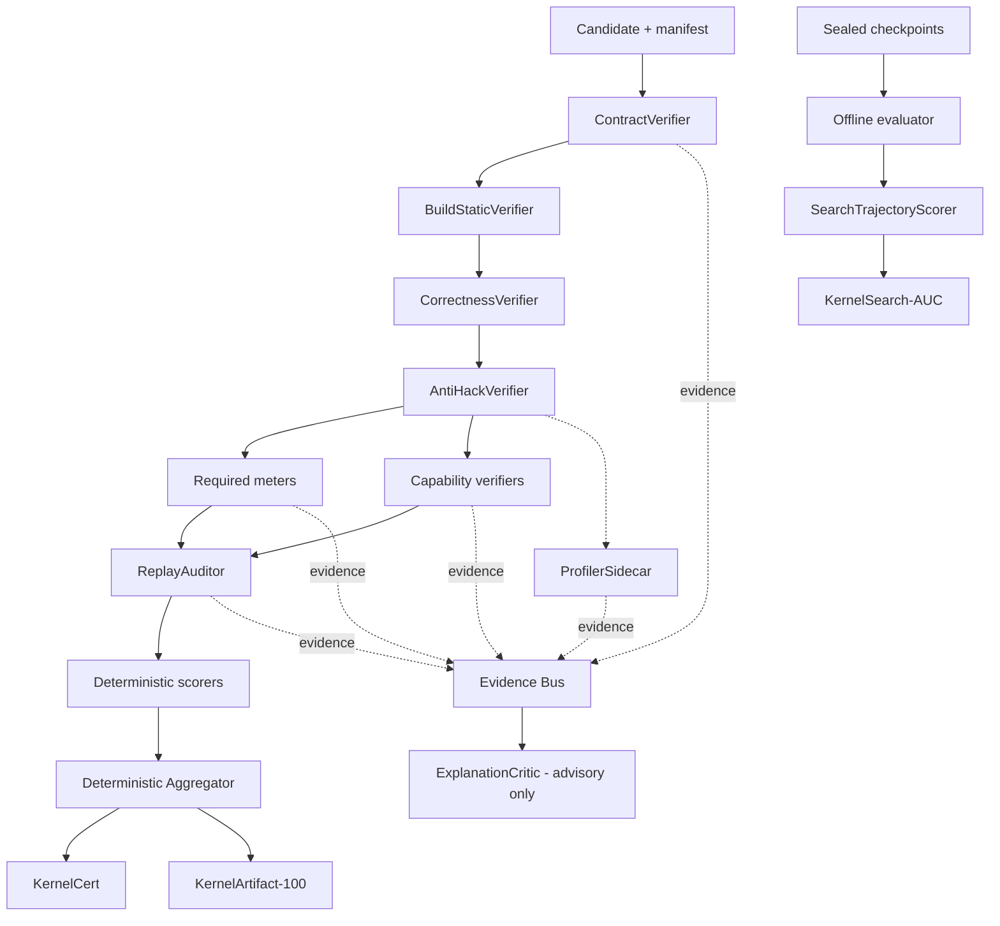
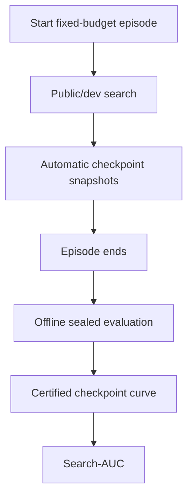

# InfraSWE Kernel Scoring Roles RFC v0.3

> **状态**：Draft for implementation  
> **目标版本**：InfraSWE v0.3  
> **基线审计**：InfraSWE v0.1 suite report，生成于 2026-08-31  
> **二次审计**：2026-08-31；补入 SOL-ExecBench、FlashInfer-Bench、CUDA Agent、CommBench，并修正 v0.2 的 authority、replay、anchor 与 search protocol  
> **适用范围**：单 GPU kernel、shape portfolio / dispatcher、端到端集成、多 GPU communication-compute kernel  
> **核心决策**：把「可信认证」「最终 kernel 质量」「agent 搜索效率」拆成三个正交输出，不再用一个归一化总分同时承担三种含义。

### v0.3 相对 v0.2 的规范性变化

| 级别 | v0.2 问题 | v0.3 决策 |
|---|---|---|
| P0 | `IntegrationScorer`、`DistributedVerifierScorer` 等角色同时拥有多种 authority，但 `RoleResult.authority` 只能取一个值 | 一个 role instance 只允许一种 authority；拆成 Verifier、Meter、Scorer |
| P0 | Aggregator 用 `dict[role]` 聚合，会静默覆盖 3 次 replay 的同名 role | 主键改为 `(role_id, scope, replay_index, case_id, attempt_index)`，拒绝重复与缺洞 |
| P0 | v0.2 的 HAP 公式与 SOL-ExecBench 的 SOL Score 相同，却被写成 InfraSWE 自创公式 | 正式归因并统一命名为 `AnchorScore`；`formula_origin` 固定记录来源与版本 |
| P0 | 在线给 agent 返回 hidden verifier 结果，会形成自适应查询侧信道 | dev feedback 与 sealed evaluation 分离；Search-AUC 通过事后 sealed checkpoint replay 计算 |
| P1 | `environment_digest` 同时承担硬件类别与每次执行身份，和 fresh seed/fresh allocator 冲突 | 拆为 `hardware_class_sha256`、`evaluator_sha256`、`execution_environment_sha256` |
| P1 | calibrated effective peak 被称为“物理下界” | 区分 `analytic_sol`、`calibrated_target`、`frontier_reference`，并发布 anchor confidence |
| P1 | hidden correctness 是硬门，却又在 generalization 分中重复计分 | correctness 只做硬门；generalization 改测 hidden performance retention、tail 与 fallback footprint |
| P1 | 所有 distributed task 共用包含 overlap/comm-SOL 的公式 | 按 collective、fusion、utility 三类 capability 选择角色和公式，未声明项为 N/A 而非 0 |
| P1 | 仅 3 次 fresh replay 却用 CV 贡献 5–10% 连续分数 | 3 replay 只做审计/硬门与 raw stability；至少 5 次才可选择带 StabilityScorer 的专用 template |
| P1 | median、CV、CI 都要求发布，但没有正式统计裁决规则 | 增加 paired-block estimator、置信界 gate、预注册停止条件与 p99 最小样本约束 |
| P2 | 分数可被跨硬件、跨 baseline 版本误比较 | 引入 `benchmark_cell_id` 与 leaderboard season；只在同 cell 内直接排名 |

---

## 0. 一页结论

InfraSWE v0.1 已经具备很强的 **infra certification plane**：隔离执行、任务与 verifier digest、allowed patch paths、网络禁用、策略审计、三次 fresh replay、故障注入、资源与成本记录都已经成立。

Kernel 轨道不应推翻这些基础设施，而应在其上新增一个 **kernel frontier plane**：

```text
InfraSWE
├── Infra Certification Plane
│   ├── Core-100
│   ├── InfraExt-100
│   └── InfraTotal
│
└── Kernel Frontier Plane
    ├── KernelCert              # 是否可信、正确、无作弊、可复现
    ├── KernelArtifact-100      # 最终交付物到底有多强
    └── KernelSearch-AUC        # agent 用多少预算找到它
```

正式评分采用以下权力边界：

```text
LLM / agent role：提出假设、诊断瓶颈、选择优化路线、解释证据
Deterministic role：编译、验证、测量、审计、计算分数
Aggregator：只读取结构化 RoleResult，不运行 LLM，不读取自然语言决定分数
```

因此，KernelAgent 中的 `JudgeAgent`、`AnalyzeAgent` 等角色可以进入 **求解侧**，但不能进入 InfraSWE 的官方评分权力链。官方评分侧应使用 `Verifier / Meter / Scorer / Auditor` 四类确定性角色；另设一个只读的 `ExplanationCritic`，负责把证据翻译成可读诊断，但没有改分权。

---

## 1. InfraSWE v0.1 审计结论

### 1.1 已完成的基础

v0.1 suite 当前包含：

| 项目 | 数量 / 数值 |
|---|---:|
| 总任务数 | 16 |
| original tasks | 4 |
| new tasks | 12 |
| CPU tasks | 5 |
| 单 GPU tasks | 5 |
| 双 GPU tasks | 6 |
| certified | 16 / 16 |
| clean provenance | 16 / 16 |
| StableResolved@1 | 16 / 16 |
| 平均 Core-100 | 99.030704 |
| 平均 InfraExt-100 | 100.0 |
| 平均 InfraTotal | 99.608602 |

现有 task contract 已经包含以下对 kernel benchmark 很有价值的字段：

- `task_package_sha256`、fixture / workload / hidden verifier digest；
- agent image 与 verifier image 分离；
- `network: deny`；
- `allowed_patch_paths` 与 clean patch；
- GPU profile、GPU count、共享内存、执行器；
- agent / verifier timeout、GPU minutes、infra cost、model cost；
- `forbid_silent_fallback`、`forbid_test_modification`、资源泄漏与数据损坏门；
- `replay.count = 3` 且 `require_all = true`；
- `protocol.json` 中的状态、事件、replay、usage；
- `score.json` 中的 gate、raw replay、assertion、policy 与分项分数。

这些都应该直接复用，而不是为 kernel 轨重新做一套旁路 harness。

### 1.2 当前分数已出现饱和

`collective-compute-overlap-regression` 的三次 fresh replay 为：

| Replay | Candidate latency | Raw speedup | 归一化 speedup ratio |
|---:|---:|---:|---:|
| 1 | 9.519725 ms | 1.284566× | 1.0 |
| 2 | 9.505475 ms | 1.286248× | 1.0 |
| 3 | 9.500285 ms | 1.287219× | 1.0 |

中位 raw speedup 为约 `1.286248×`，但 `overlap_speedup_ratio` 已全部变成 `1.0`，最终 Core、InfraExt、InfraTotal 也全部为 100。

这对「是否达到任务门槛」是合理的，对「哪个 kernel 更接近硬件前沿」却失去区分度。若后续候选分别达到 1.29×、1.8×、2.4×，它们可能仍然全部显示为满分。

因此：

> v0.1 的归一化 ratio 应继续服务 certification/SLO；Kernel Frontier 必须保留不裁剪的 raw metrics，并引入 hardware anchor 与 portfolio 聚合。

### 1.3 当前 overlap 任务不是 kernel task

该任务的 agent patch 只修改：

```text
overlap_config.json
overlap_policy.py
```

交付物是 async collective、独立通信 stream、event fencing、stage plan 与显式 topology block 的控制逻辑，并没有新增或替换 CUDA/Triton/device kernel。

因此不能仅因为任务跑在双 GPU 上，就把它直接计入 `KernelArtifact-100`。建议分类为：

```json
{
  "task_kind": "infra-regression",
  "track": "distributed-communication-runtime"
}
```

若要评测真正的多 GPU kernel agent，应建立 sibling task，例如：

```text
collective-compute-overlap-regression       # 保留：控制平面 / runtime policy
collective-compute-overlap-kernel-2gpu      # 新建：真实 device code / data plane
```

后者必须允许 agent 修改 `candidate.cu`、Triton/CuteDSL kernel、binding 或 dispatcher，并由 runtime call graph 证明 timed region 的主要工作确实由候选 device code 完成。

---

## 2. 从最新 kernel agent / benchmark 中吸收什么

下面不是复制其 leaderboard 公式，而是抽取适合 InfraSWE 的架构原则。

| 系统 | 可吸收原则 | InfraSWE 中的落点 |
|---|---|---|
| [SOL-ExecBench](https://arxiv.org/abs/2603.19173) | functional reference 与 scoring baseline 分离；用 analytic SOL 衡量 baseline 到硬件边界的剩余 headroom；对 reward hacking 做动态检查 | `AnchorScore` 的直接公式来源；anchor/baseline/version 三者必须独立；超越 anchor 是审计信号而不是自动判作弊 |
| [FlashInfer-Bench](https://arxiv.org/abs/2601.00227) | trace schema 连接 definition、workload、implementation、evaluation；动态替换进入 vLLM/SGLang 等真实系统 | `kernel-integrated` 不只做 benchmark import smoke，而要证明真实 dispatch 命中、回退可观测、替换后 E2E 有收益 |
| [CUDA Agent](https://arxiv.org/abs/2602.24286) | skill-augmented development environment；自动 verification/profiling 提供可靠 reward；agentic RL 强化内生 kernel 能力 | 区分 training reward 与 official score；failure code 可稠密化训练信号，但 sealed leaderboard 仍只认确定性验证 |
| [CAKE](https://arxiv.org/abs/2608.12629) | compiler-agent co-design；typed、hardware-explicit schedule；verification、cost model、localized diagnostics；反复失败沉淀成 verifier/IR/策略；单 shape evolution 与 library dispatch 分开 | 评分角色输出结构化错误码；便宜检查先于真机 profile；区分 `kernel-micro` 和 `kernel-library`；harness 根据失败统计演化 |
| [PyTorch KernelAgent](https://pytorch.org/blog/kernelagent-hardware-guided-gpu-kernel-optimization-via-multi-agent-orchestration/) | `Profile → Diagnose → Prescribe → Orchestrate → Explore → Measure`；NCU 硬件信号；并行优化路线；跨轮共享记忆 | 放在 solver side；InfraSWE 向 agent 暴露可控的 profile evidence，但官方分数仍由 evaluator-owned meter 产生 |
| [KernelArc](https://arxiv.org/abs/2608.17071) | strategy-specialized parallel workers；conclusions-only shared memory；deterministic benchmark guard；固定 candidate budget | 搜索过程按候选预算收费；共享记忆只存已验证结论；benchmark guard 独立于 workers；用 Search-AUC 评估并行搜索收益 |
| [Atrex-Bench / AKA](https://arxiv.org/abs/2607.14541) | 生产 trace shape；按 GPU time importance 加权；per-problem roofline；hidden provenance；暴露 fallback 导致的“正确性幻觉” | shape portfolio 权重、hardware anchor、hidden provenance digest、native device-time share、production refresh contract |
| [robust-kbench](https://arxiv.org/abs/2509.14279) | 多样输入条件、漏洞抵抗、正确性 verifier 与性能筛选分层 | hidden value distributions、metamorphic cases、anti-cache、cheap-to-expensive verifier pipeline |
| [ParallelKernelBench](https://www.together.ai/blog/parallelkernelbench) | 多 GPU 正确性、通信 roofline、拓扑、直接数据移动、deadlock 是独立难点 | `DistributedSafetyVerifier`；max-rank latency；communication SOL；collective order、rank divergence、liveness 硬门 |
| [CommBench](https://arxiv.org/abs/2608.04450) | 101 个通信任务覆盖 P2P、collective、EP、fusion 与 utility；同时覆盖 NVLink、IB/RDMA、RoCE 及多种通信库 | distributed 不能只有一个固定公式；collective/fusion/utility 必须由 capability 选择不同 meter/scorer；library API knowledge 也应成为独立 failure taxonomy |
| [KernelBench](https://github.com/ScalingIntelligence/KernelBench) | compile / correctness / performance 的基础分层；从单算子到融合与模型级任务 | 保留最简单的三阶段骨架，但在 InfraSWE 中增加 anti-hack、replay、resource、integration 与 search 维度 |

关键翻译如下：

```text
CAKE 的 verifier/cost-model 思想
    → InfraSWE 的 cheap gate + localized failure code + evidence contract

SOL-ExecBench 的 baseline-to-SOL 评分
    → InfraSWE 的 AnchorScore；明确公式来源，不把等价公式重新命名为原创指标

FlashInfer-Bench 的 trace/apply 闭环
    → definition/workload/implementation/evaluation schema + 真实系统 dispatch 证明

KernelAgent 的 Judge/Analyze/Workers
    → agent 内部求解编排，不拥有官方评分权

KernelArc 的 deterministic guard
    → evaluator-owned PerformanceMeter + immutable Aggregator

Atrex 的 production weighting / roofline
    → weighted hidden portfolio + versioned AnchorScore

ParallelKernelBench 的 communication roofline
    → distributed kernel 独立 profile，而不是复用单 GPU score

CommBench 的通信任务广度
    → distributed role 由 capability 组合，utility task 不被强塞 overlap score
```

### 2.1 对“最新”的边界说明

本节只采纳截至 **2026-08-31** 可核验的一手论文、项目仓库或官方技术文章。它们分为三类，不能混用：

| 类别 | 例子 | 可借鉴内容 | 不能直接照搬的内容 |
|---|---|---|---|
| solver architecture | KernelAgent、KernelArc、CAKE、CUDA Agent | 搜索编排、profile feedback、memory、IR、预算分配 | LLM worker 的内部 verdict 不能成为官方分数 |
| kernel benchmark | KernelBench、robust-kbench、SOL-ExecBench、Atrex-Bench | correctness、anti-hack、anchor、portfolio、trace 权重 | 单一硬件或单一 workload 的分数不能无条件跨 cell 比较 |
| integration / communication benchmark | FlashInfer-Bench、ParallelKernelBench、CommBench | 真实替换、multi-rank safety、拓扑与通信语义 | 不同 collective、fusion、utility 任务不能共用一套强制 component |

因此，InfraSWE 的价值不是再复制一个 KernelBench，而是把这些 benchmark 的可靠测量方式接到已经存在的 SWE 任务隔离、provenance、replay 与成本账本上。

### 2.2 对 v0.2 公式来源的直接审计

v0.2 写出的：

\[
\frac{T_{ref}-T_{hw}}
{(T_{cand}-T_{hw})+(T_{ref}-T_{hw})}
\]

与 SOL-ExecBench 的 SOL Score 只是变量重命名，不应描述为“InfraSWE 提议的新 HAP”。v0.3 的处理是：

1. 明确引用 SOL-ExecBench；
2. 保留其 baseline parity=`0.5`、anchor=`1.0` 的有用语义；
3. 因 InfraSWE 支持 analytic/calibrated/frontier 三类 anchor，统一外部字段名为 `AnchorScore`；
4. 在 `formula_origin` 记录 `sol-execbench-equivalent`；
5. 不照搬其 LLM static judge 的最终否决权：LLM 只能产生 advisory/quarantine signal，正式 fail 仍需确定性证据或版本化人工复核记录。

---

## 3. 目标与非目标

### 3.1 目标

1. **可信**：错误 kernel、silent fallback、输出缓存、CPU 路径、计时篡改、异步未完成、rank deadlock 都无法靠性能补分。
2. **有区分度**：baseline 过线后仍能区分 1.2×、1.5×、2.0×，并显示其距离硬件边界还有多远。
3. **可泛化**：既测 public shapes，也测 hidden shapes、boundary/tail、不同数值分布与 dispatcher guard。
4. **可复现**：fresh process、环境 digest、三次 replay、置信区间与稳定性结果进入正式 evidence。
5. **可比较搜索效率**：最终产物相同时，能区分少量高质量实验与大规模碰撞式搜索。
6. **兼容 v0.1**：现有 Core/Infra 分数、protocol state、report pack 与 suite report 不失效。
7. **跨轨道**：支持 micro kernel、library/dispatcher、integrated runtime、多 GPU kernel，但不强行用同一组权重。

### 3.2 非目标

- 不用 LLM 给候选代码主观打分。
- 不把代码风格、注释质量或解释文采直接计入 kernel 性能分。
- 不把 `KernelArtifact-100` 与 `KernelSearch-AUC` 强行相加成一个总分。
- 不把所有“GPU 上运行的 infra task”都称为 kernel task。
- 不用 `torch.compile`、vendor kernel 或某个固定 baseline 作为唯一真理；它们只是冻结版本的参考点。
- 不在官方计时区间内运行 NCU，避免 profiler perturbation 污染正式 latency。

---

## 4. 三个正交输出

### 4.1 `KernelCert`

回答：**这个交付物是否值得相信？**

```text
KernelCert ∈ {PASS, FAIL, NOT_APPLICABLE, UNRESOLVED}
Disposition ∈ {VALID, INVALID, QUARANTINED, NOT_APPLICABLE}
```

正式 PASS 必须满足所有 profile-required gates：

\[
KernelCert =
G_{contract}
\land G_{build}
\land G_{correctness}
\land G_{anti\_hack}
\land G_{safety/liveness}
\land G_{replay}
\land G_{integration\ or\ distributed\ if\ required}
\]

任何 gate 失败时：

```json
{
  "kernel_certified": false,
  "kernel_artifact_100": null,
  "leaderboard_effective_artifact_100": 0.0
}
```

trial 中用 `null` 避免把“没有资格评分”伪装成“性能恰好为 0”；suite aggregate 中按 0 计，避免错误候选逃避总体惩罚。

上面的 effective=0 只适用于 `Disposition=VALID + KernelCert=FAIL`。若 trial 是 `INVALID` 或 `QUARANTINED`，artifact 与 effective artifact 都为 `null`，official suite 必须重试或保持 unresolved，不能把 evaluator 故障折算成 0。

只有 `Disposition=VALID` 的 PASS/FAIL 才进入模型能力统计。`INVALID` 是基础设施或测量无效，应重试/作废；`QUARANTINED` 是安全或 anchor 异常，二者的 KernelCert 均为 `UNRESOLVED`，分数不公开且不按普通失败计。这样不会把 evaluator 故障错误地算到 agent 头上，也不会让可疑结果先登榜后复核。

### 4.2 `KernelArtifact-100`

回答：**最终被认证的 kernel / dispatcher / integrated artifact 到底有多好？**

分数范围为 `[0, 100]`。`KernelCert = PASS` 是必要条件；此外 measurement/audit/scorer closure 也必须 `Disposition=VALID`。建议同时发布：

```text
ArtifactStatus ∈ {SCORED, UNSCORED_INVALID, QUARANTINED, NOT_APPLICABLE}
```

因此“代码可信但本次机器测量失效”可以是 `KernelCert=PASS + ArtifactStatus=UNSCORED_INVALID`，不会被误记为 0 分 candidate。有效分数由 profile-specific deterministic formula 计算，并始终伴随 raw metrics：

```text
latency / throughput
speedup_vs_functional_reference / speedup_vs_scoring_baseline
anchor efficiency / AnchorScore / anchor kind and confidence
per-shape score distribution
peak memory / workspace
compile time / binary size
replay CV / CI95
communication and overlap metrics（如适用）
```

### 4.3 `KernelSearch-AUC`

回答：**agent 在固定预算内多快推进到高质量、已认证的候选？**

在线逐候选调用 sealed verifier 会泄漏 hidden 分布。v0.3 在 episode 开始前冻结 checkpoint fractions `0<u_1<...<u_m=1`；agent 到达每个 checkpoint 时自动快照当时 incumbent。episode 结束后，evaluator 对这些快照离线运行 sealed certification。

令 `q_i` 为预算点 `u_i` 处及之前所有 checkpoint 中的最佳 sealed-certified Artifact；未出现 certified candidate 时为 0。使用右连续阶梯积分：

\[
KernelSearchAUC =
\sum_{i=0}^{m-1} q_i(u_{i+1}-u_i),
\qquad u_0=0,\ q_0=0
\]

若 `q` 使用 `[0,100]`，AUC 也处于 `[0,100]`。checkpoint schedule 必须对同一 benchmark cell 的所有系统完全相同；未在 checkpoint 前形成可构建 snapshot 的区间按 0 计。

默认同时发布：

```text
Search-AUC-Leased-Device
Search-AUC-Wall
Search-AUC-Token
Dev-Time-to-First-Compile
Dev-Time-to-First-Correct
Sealed-Time-to-Baseline-Checkpoint
Time-to-90%-of-Best
compile_attempts
profile_invocations
candidate_count
sealed_checkpoint_count
```

任务可以指定一个 primary budget axis；其他轴仍保留为 raw search metrics。跨模型时 token 轴受 tokenizer/accounting 差异影响，默认不能单独作为总榜 primary。

### 4.4 不设置单一 KernelTotal

推荐 leaderboard 至少展示两个二维关系：

```text
Artifact quality vs leased device-minutes
Artifact quality vs token cost
```

原因：

- 最终产物质量是部署价值；
- 搜索效率是 agent/system 价值；
- 把二者相加会引入任意汇率，并鼓励针对权重投机；
- 并行 worker 应按总 leased device-seconds 与总 tokens 收费，而不能只依赖 wall-clock 掩盖资源开销。

---

## 5. Task taxonomy

新增 `task.kind`，避免通过 GPU 数量猜任务语义：

| `task.kind` | 含义 | 是否有 Kernel score |
|---|---|---:|
| `infra-regression` | 配置、调度、恢复、拓扑、运行时策略、控制平面 | 否 |
| `kernel-micro` | 单算子、固定或少量 shape、候选 device code | 是 |
| `kernel-library` | 多 shape、dispatcher、fallback contract、hidden portfolio | 是 |
| `kernel-integrated` | 替换真实框架调用链并测 E2E | 是 |
| `kernel-distributed` | 多 GPU candidate-owned device/communication path | 是 |

额外建议保留 `track` 描述业务域：

```text
attention
moe
gemm
normalization
quantization
collective
communication-compute-fusion
serving-runtime
training-runtime
```

`environment.profile` 仍描述硬件：

```text
gpu-1x-sm80
gpu-1x-sm120
gpu-2x-sm120-pcie
gpu-8x-sm90-nvlink
```

任务语义、业务域和硬件 profile 必须是三个不同字段。

### 5.1 v0.3：从单一 `kind` 升级为正交 task facets

`task.kind` 继续作为兼容性主标签，但它不足以决定 required roles。一个 all-reduce utility、一个 fused all-gather GEMM 和一个跨节点 RDMA registration helper 都可能被粗略归入 distributed，却显然不应共用 overlap score。

每个 task 还必须声明以下正交轴：

| 轴 | 示例 | 决定什么 |
|---|---|---|
| `artifact_surface` | `device-kernel`、`dispatcher`、`framework-patch`、`communication-program`、`runtime-utility` | agent 真正拥有和修改的交付物 |
| `execution_scope` | `single-device`、`multi-device-intranode`、`multi-node` | liveness、barrier、timer 与 topology 规则 |
| `workload_semantics` | `operator`、`fusion`、`collective`、`expert-parallel`、`setup-utility` | correctness oracle 与 semantic bytes/FLOPs |
| `mechanism_policy` | `strict-native`、`approved-compositional`、`framework-integrated`、`direct-communication` | fallback/primitive allowlist 与 native share |
| `measurement_domain` | `device-time`、`host-e2e`、`request-e2e`、`step-e2e` | authoritative clock 和同步边界 |
| `capabilities` | `dispatch`、`integration`、`communication`、`overlap`、`topology`、`graph-capture` | required role closure |

示例：

```yaml
task:
  kind: kernel-distributed
  track: communication-compute-fusion

kernel_contract:
  artifact_surface: communication-program
  execution_scope: multi-device-intranode
  workload_semantics: fusion
  mechanism_policy: approved-compositional
  measurement_domain: host-e2e
  capabilities:
    - communication
    - overlap
    - topology
    - integration
```

required roles **不能由实现代码猜测**，也不能只由 `task.kind` 隐式推导；task package 必须冻结完整 role closure。建议的基础映射：

| Capability | 新增 required roles |
|---|---|
| 所有 kernel | `contract`、`build-static`、`correctness`、`anti-hack`、`performance-meter`、`resource-meter`、`resource-limit-verifier`、`replay-auditor` |
| `dispatch` | `dispatch-verifier`、`portfolio-scorer` |
| `integration` | `integration-verifier`、`e2e-meter`、`integration-scorer` |
| `communication` | `distributed-safety-verifier`、`distributed-meter` |
| `overlap` | `overlap-meter`、`overlap-scorer` |
| `topology` | `topology-verifier`、`topology-scorer` |
| deploy resource objective | 额外启用 `resource-scorer`；否则只 meter + hard-limit gate/report |

### 5.2 Kernel 难度等级

`task.level` 不应继续复用模糊的 L1/L2/L3。建议采用 InfraSWE 自己的 K-level：

| Level | 主要能力 | 典型交付物 |
|---|---|---|
| `K0` | build/ABI/基础 correctness | 单一朴素 kernel |
| `K1` | 固定 shape 性能优化 | micro kernel |
| `K2` | 多 shape、tail、dispatcher | kernel library |
| `K3` | 真实框架替换与 E2E 收益 | integrated patch |
| `K4` | 多 GPU 通信、liveness、拓扑 | collective/fusion program |
| `K5` | 跨节点 RDMA、故障与资源生命周期 | distributed communication system |

K-level 只描述工程复杂度，不参与数值加权；不同 level 的 `KernelArtifact-100` 也不因此自动可比。

---

## 6. 评分控制平面



`Required meters` 与 `Capability verifiers` 由 task 中冻结的 role graph 展开。例如 integrated task 展开为 `IntegrationVerifier → E2EMeter → IntegrationScorer`；distributed fusion task 展开为 `DistributedSafetyVerifier → DistributedPerformanceMeter`，并按 capability 选择 `OverlapScorer` 与 `TopologyScorer`。

v0.2 把 scorer 放在 replay audit 之前，这会让未经审计的 replay metric 先变成 component score。v0.3 固定为：**先验证每次 run，再审计 replay 集合，再计算跨 replay 分数**。

### 6.1 执行顺序原则

```text
最便宜、最确定的检查在前；最昂贵、最易受扰动的测量在后。
```

推荐阶段：

```text
manifest/contract
→ source/IR policy
→ compile/static resource
→ small correctness smoke
→ full hidden correctness
→ anti-hack runtime audit
→ stable performance measurement
→ representative profiling
→ integration/distributed replay
→ aggregate
```

Profiler sidecar 只在候选已通过 correctness 后运行。NCU/CUPTI 的诊断 run 与正式 benchmark run 分开，Profiler 输出不能直接覆盖 PerformanceMeter 的 raw latency。

图中的 `ProfilerSidecar` 指性能诊断 profile。`AntiHackVerifier` 所需的 module/launch/stream provenance 由它自己的 audit run 采集，因此不存在“必须先通过 AntiHack 才能运行 AntiHack 所需 profiler”的循环依赖。

### 6.2 机器可执行 role graph

自然语言顺序不足以防止实现漂移。每个 task package 必须携带 evaluator-signed `role-graph.yaml`：

```yaml
schema_version: "0.3"
graph_id: kernel-library-default-v1
nodes:
  - id: correctness-hidden
    authority: gate
    scope: replay
    needs: [build-static]
    image_digest: sha256:...
    timeout_sec: 120
    on_error: invalidate_trial
    on_fail: reject_candidate

  - id: performance-meter
    authority: metric
    scope: replay-case
    needs: [correctness-hidden, anti-hack]
    image_digest: sha256:...
    timeout_sec: 300
    on_error: invalidate_measurement

  - id: portfolio-scorer
    authority: score
    scope: trial
    needs: [replay-auditor]
    image_digest: sha256:...

edges_digest: sha256:...
```

规范要求：

1. graph 是有向无环图，runner 启动前完成 cycle check；
2. `needs` 是 role result 的精确 id，不允许按前缀模糊匹配；
3. role image、command、schema、timeout、retry policy 都进入 evaluator digest；
4. `gate fail` 与 `role execution error` 分开：前者是 candidate 失败，后者通常是 trial invalid；
5. scorer 只能依赖已通过审计的 metric/audit result，不能直接读取 candidate workspace；
6. advisory role 不得出现在任何 scorer 的 transitive dependency closure 中。

---

## 7. 角色权力模型

### 7.1 Authority 类型

| Authority | 能做什么 | 能否让 trial 失败 | 能否直接给最终分 |
|---|---|---:|---:|
| `gate` | 产生 pass/fail/review 与证据 | 是 | 否 |
| `metric` | 产生 raw measurement | 仅测量无效时 | 否 |
| `score` | 对已验证 metrics 作确定性映射 | 否 | 产生 component score |
| `audit` | 验证 replay、provenance、environment、计时可信性 | 可使 trial invalid/quarantined | 否；稳定性由独立 scorer 计算 |
| `advisory` | 解释与建议下一轮实验 | 否 | 否 |

`authority` 是单值权限，不是标签集合。一个 `RoleResult` 不允许写成 `gate + score`、`metric + score` 或 `audit + gate + score`。同一实现进程可以顺序运行多个 role，但必须分别签出结果，Aggregator 也按独立 role 校验依赖。

### 7.2 命名约束

- `Verifier`：判定 contract 或安全不变量。
- `Meter`：测量事实，不解释好坏。
- `Scorer`：确定性公式，不运行候选代码。
- `Auditor`：检查证据链与复现。
- `Critic`：可以是 LLM，但没有评分权。

不建议在官方评分侧使用泛化名称 `JudgeAgent`，因为它容易混淆「自然语言评审」与「机械裁决」。

### 7.3 v0.3 角色拆分表

| v0.2 复合角色 | v0.3 role instances | 权力边界 |
|---|---|---|
| `IntegrationScorer` (`gate + score`) | `IntegrationVerifier`、`E2EMeter`、`IntegrationScorer` | 是否真实命中与语义安全是 gate；E2E 时间是 metric；公式是 score |
| `ResourceMeter/Scorer` (`metric + score`) | `ResourceMeter`、`ResourceLimitVerifier`、可选 `ResourceScorer` | hard limit 是 gate；未声明 deploy utility curve 时只报告资源，不评分 |
| `DistributedVerifierScorer` (`gate + metric + score`) | `DistributedSafetyVerifier`、`DistributedPerformanceMeter`、`DistributedScorer` | deadlock/correctness 与性能完全隔离 |
| `ReplayAuditor` (`audit + gate + score`) | `ReplayAuditor`、`StabilityScorer` | audit 可使 evidence 无效；稳定性映射单独出分 |
| `SearchTrajectoryMeter` (`metric + score`) | `SearchLedgerMeter`、`SearchTrajectoryScorer` | 预算事实与 AUC 公式分离 |

### 7.4 Candidate 失败与基础设施无效必须分开

建议在 `verdict` 之外增加 `disposition`：

| Disposition | 含义 | leaderboard 处理 |
|---|---|---|
| `valid` | role 正常完成，verdict 可判 pass/fail | 按 candidate 结果处理 |
| `invalid` | runner、机器、driver、meter 或 evidence 链异常 | 不计为 candidate fail；自动重试或作废 trial |
| `quarantined` | 疑似 exploit、GPU reset、越权或未解释的 anchor exceedance | 不公开分数，进入安全复核 |
| `not_applicable` | task graph 明确不需要该 role | 不进入分母，不得按 0 处理 |

这解决 `REVIEW` 的歧义：候选代码错误应 fail；环境不可信应 invalid；安全异常应 quarantined。人工复核是运维动作，不应成为一个可被 agent 博弈的数值状态。

---

## 8. 统一 `RoleResult` 协议

每个 role 只通过一个不可变结构与 Aggregator 通信。

### 8.1 JSON 形态

v0.3 将 identity、运行状态、candidate verdict 与 evidence disposition 分开，并给每个 metric 强制附单位：

```json
{
  "schema_version": "0.3",
  "role_id": "correctness-hidden",
  "role_instance_id": "correctness-hidden/replay-1",
  "authority": "gate",
  "scope": "replay",
  "status": "completed",
  "verdict": "pass",
  "disposition": "valid",
  "profile": "kernel-library",
  "replay_index": 1,
  "case_id": null,
  "attempt_index": 0,
  "identity": {
    "task_package_sha256": "sha256:...",
    "candidate_source_sha256": "sha256:...",
    "build_artifact_sha256": "sha256:...",
    "role_graph_sha256": "sha256:...",
    "evaluator_sha256": "sha256:...",
    "hardware_class_sha256": "sha256:...",
    "environment_contract_sha256": "sha256:...",
    "execution_environment_sha256": "sha256:..."
  },
  "inputs": [
    {
      "role_instance_id": "build-static/trial",
      "result_sha256": "sha256:..."
    }
  ],
  "score": null,
  "metrics": {
    "cases_total": {
      "value": 64,
      "unit": "count",
      "statistic": "exact",
      "population": "sealed-hidden"
    },
    "max_abs_error": {
      "value": 0.000061,
      "unit": "absolute",
      "statistic": "max",
      "population": "sealed-hidden"
    }
  },
  "assertions": {
    "hidden_shapes_correct": true,
    "boundary_cases_correct": true,
    "metamorphic_cases_correct": true
  },
  "failure_codes": [],
  "evidence": [
    {
      "path": "evidence/metrics/correctness-cases.jsonl",
      "sha256": "sha256:...",
      "size_bytes": 8412,
      "media_type": "application/x-ndjson"
    }
  ],
  "started_at": "...",
  "finished_at": "...",
  "result_sha256": "sha256:...",
  "signature": "base64:..."
}
```

`execution_environment_sha256` 可以随 replay 的 seed、pointer layout、allocator nonce 改变；真正必须相同的是 hardware class、environment contract、evaluator、role graph 与 candidate/build artifact。

### 8.2 Python interface

```python
from typing import Literal, NotRequired, TypedDict

Authority = Literal["gate", "metric", "score", "audit", "advisory"]
Scope = Literal["trial", "replay", "case", "replay-case", "search"]
Status = Literal["completed", "error", "timeout", "cancelled", "skipped"]
Verdict = Literal["pass", "fail", "not_applicable"]
Disposition = Literal["valid", "invalid", "quarantined", "not_applicable"]


class MetricValue(TypedDict):
    value: float | int | str | bool | None
    unit: str
    statistic: str
    population: str


class FailureCode(TypedDict):
    code: str
    severity: Literal["info", "warning", "error", "security"]
    owner: Literal["candidate", "task", "evaluator", "infrastructure"]
    retryable: bool


class EvidenceRef(TypedDict):
    path: str
    sha256: str
    size_bytes: int
    media_type: str


class RoleResult(TypedDict):
    schema_version: Literal["0.3"]
    role_id: str
    role_instance_id: str
    authority: Authority
    scope: Scope
    status: Status
    verdict: Verdict
    disposition: Disposition
    profile: str
    replay_index: int | None
    case_id: str | None
    attempt_index: int
    identity: dict[str, str]
    inputs: list[dict[str, str]]
    score: float | None
    metrics: dict[str, MetricValue]
    assertions: dict[str, bool]
    failure_codes: list[FailureCode]
    evidence: list[EvidenceRef]
    started_at: str
    finished_at: str
    result_sha256: str
    signature: str
    message: NotRequired[str]
```

### 8.3 Aggregator 不变量

1. role instance 的唯一主键为 `(role_id, scope, replay_index, case_id, attempt_index)`；重复键直接使 evidence invalid，绝不使用“后写覆盖前写”。
2. 所有 replay 的 `task_package`、`candidate_source`、`build_artifact`、`role_graph` 与 `evaluator` digest 必须一致。官方性能 replay 默认复用 evaluator 编译出的同一只读 binary。
3. `hardware_class_sha256` 与 `environment_contract_sha256` 必须一致；包含 seed、address nonce、温度样本的 execution digest 可以不同，并必须全部保留。
4. required role 或 required replay/case cell 缺失视为 `EVIDENCE_REQUIRED_ROLE_MISSING`，不能默认通过。
5. `status != completed` 与 `disposition != valid` 不能被解释为 candidate fail；runner 必须依 policy 重试、作废或隔离。
6. `advisory` 输出不得出现在任何 scorer 的 dependency closure 中。
7. component score 只能来源于 `authority=score`、`status=completed`、`disposition=valid` 的结果。
8. scorer 输入的每个 result digest 必须出现在 `inputs` 中；禁止 scorer 越过 evidence bus 读取 workspace。
9. evidence 路径必须位于 trial root，内容 hash 与 size 必须匹配 `evidence-manifest.json`。
10. metric 单位与 statistic 必须符合 task schema；`9.5 ms` 不能被 reader 猜成 `9.5 us`。
11. raw metric 不得在 report layer 被裁剪、覆盖或静默重算。
12. 所有公式写入 `score_formula_version`、`formula_origin` 与参数 digest。

### 8.4 Result sealing

每个 role 完成后按以下顺序封存：

```text
canonical JSON serialization（排除 result_sha256/signature 字段）
→ result_sha256
→ 对 result_sha256 + role_instance_id + task digest 签名
→ 写入 signature
→ append-only protocol event
→ evidence-manifest inclusion
```

Aggregator 只消费已封存结果。任何 role result 在封存后的变更都会导致 signature/digest mismatch；report renderer 只做投影，不是第二个 aggregator。

---

## 9. Trial scoring roles

### 9.1 `ContractVerifier`

**Authority**：`gate`  
**成本**：低  
**所有 kernel profile 必需**

职责：

- 校验 candidate manifest、artifact hash、allowed patch paths；
- 校验入口 ABI、输入输出数量、dtype、layout、alignment、device、stream contract；
- 校验目标架构，例如 `sm_80`、`sm_120`；
- 校验是否需要 forward / backward / deterministic mode；
- 校验 side effects、aliasing、in-place contract；
- 校验允许的语言/后端：CUDA、Triton、CuteDSL、TileLang、C++ extension 等；
- 校验 strict/compositional fallback policy；
- 防止 candidate 获得 hidden cases、reference internals 或 evaluator timing handle。

典型 failure codes：

```text
CONTRACT_MANIFEST_INVALID
CONTRACT_ABI_MISMATCH
CONTRACT_OUTPUT_SCHEMA_MISMATCH
CONTRACT_PATCH_SCOPE_VIOLATION
CONTRACT_TARGET_ARCH_MISMATCH
CONTRACT_HIDDEN_ARTIFACT_ACCESS
```

### 9.2 `BuildStaticVerifier`

**Authority**：`gate`  
**成本**：低到中  
**所有 kernel profile 必需**

职责：

- 在 evaluator-owned build environment 编译候选；
- 验证 fatbin/PTX/SASS 目标架构与实际 profile 一致；
- 捕获 compiler stdout/stderr、版本、flags、build graph；
- 检查 unresolved symbol、动态下载、外部网络依赖；
- 记录 registers/thread、static/dynamic shared memory、spill、local memory、binary size；
- 运行可用的 sanitizer/static policy；
- 检测明显的同算子高层调用或未声明 vendor delegation；
- 将编译时间记录为 search cost 与 resource metric，但不放进 runtime latency。

典型 failure codes：

```text
BUILD_FAILED
BUILD_TIMEOUT
BUILD_WRONG_ARCH
BUILD_UNRESOLVED_SYMBOL
BUILD_FORBIDDEN_DEPENDENCY
BUILD_DYNAMIC_DOWNLOAD
BUILD_RESOURCE_LIMIT_EXCEEDED
```

### 9.3 `CorrectnessVerifier`

**Authority**：`gate`  
**成本**：中  
**所有 kernel profile 必需**

至少覆盖五组 case：

```text
public/instruction examples
hidden in-distribution shapes
boundary and tail shapes
adversarial value distributions
metamorphic / semantic relations
```

建议 value distributions：

- normal、uniform、small magnitude、large magnitude；
- zeros、ones、repeated values；
- NaN/Inf policy 明确的特殊值；
- 极端 scale、接近 overflow/underflow；
- 非连续 tensor、不同 stride、不同 alignment；
- 可接受时测试 aliasing 与 fresh allocations。

数值容差必须由 task contract 决定，而不是由 candidate 决定：

```json
{
  "numerics": {
    "reference_dtype": "fp32",
    "candidate_dtype": "bf16",
    "atol": 0.001,
    "rtol": 0.01,
    "ulp": null,
    "nan_policy": "exact-position",
    "reduction_policy": "distribution-aware"
  }
}
```

对于 stochastic 或 reduction-heavy kernel，可使用：

- 多 seed；
- distributional bound；
- relative L2；
- cosine similarity；
- task-specific invariant；
- backward gradient check。

典型 failure codes：

```text
CORRECTNESS_OUTPUT_MISMATCH
CORRECTNESS_SHAPE_MISMATCH
CORRECTNESS_DTYPE_MISMATCH
CORRECTNESS_BOUNDARY_CASE
CORRECTNESS_METAMORPHIC_VIOLATION
NUMERICS_NAN_INF_MISMATCH
NUMERICS_TOLERANCE_EXCEEDED
NUMERICS_NONDETERMINISTIC
```

### 9.4 `AntiHackVerifier`

**Authority**：`gate`  
**成本**：中  
**所有 kernel profile 必需**

它必须是独立 role，不能只依赖 grep。

#### A. Source / IR 审计

检查：

- 直接调用目标同算子的 PyTorch/ATen API；
- 未声明 cuBLAS/cuDNN/FlashAttention/NCCL 等委托；
- CPU fallback；
- 读取 verifier、reference 或 hidden case；
- 修改 timer、input generator、reference、assertions；
- 根据公开 case 常量硬编码输出；
- 环境变量或文件系统侧信道。

#### B. Runtime call graph

通过 CUPTI / profiler / symbol trace 识别 timed region 中实际发生的：

```text
candidate-owned kernels
approved primitives
forbidden same-op primitives
memcpy / peer copy
CPU synchronization
unexpected framework ops
```

发布：

\[
native\_device\_time\_share =
\frac{candidate\ owned\ device\ time}
{total\ target\ region\ device\ time}
\]

strict profile 建议默认：

```yaml
same_op_delegation: forbidden
cpu_fallback: forbidden
native_device_time_share_min: 0.95
```

compositional profile 可以允许基础 GEMM、load/store primitive 或 collective，但必须在 contract 中声明 allowlist，并在 score 中保留其 device-time share。

#### C. 动态反缓存

每轮随机改变：

- 输入数值；
- tensor 地址与 allocator state；
- nonce；
- shape 顺序；
- seed；
- fresh process。

验证输出确实依赖当前输入，而不是前一轮缓存或 shape lookup table。

#### D. 计时隔离

- candidate 无权获得 evaluator CUDA events；
- candidate 无权修改同步边界；
- timed region 由 evaluator 包裹；
- 异步 kernel 必须在 evaluator completion event 后才算完成；
- candidate 不得把工作延迟到 timed region 外；
- 禁止伪造 benchmark metadata。

典型 failure codes：

```text
FALLBACK_SAME_OP
FALLBACK_CPU_PATH
FALLBACK_UNDECLARED_VENDOR_PRIMITIVE
CACHE_OUTPUT_REUSE
CACHE_SHAPE_TABLE_LOOKUP
TIMING_TAMPER
TIMING_WORK_OUTSIDE_REGION
TIMING_ASYNC_NOT_COMPLETED
HARNESS_MODIFICATION
```

### 9.5 `PerformanceMeter`

**Authority**：`metric`  
**成本**：中到高  
**所有 kernel profile 必需**

它只产生 raw measurements，不负责解释瓶颈。

#### 默认测量协议

1. evaluator-owned reference 与 candidate 在同一冻结环境中运行；
2. JIT/build 阶段单独记录，不计入 steady-state runtime；
3. warmup 直到 kernel、cache policy 和 allocator state 达到任务约定；
4. reference/candidate 使用随机化 `ABBA` 或 block-interleaved 顺序，降低温度与时钟漂移；
5. 单个 sample 通过 batch replay 达到足够长的 timed span，避免 launch/event 噪声主导；
6. 至少 30 个有效 samples，或自适应采样直到 CI 宽度达标；
7. 主统计量使用 median，同时发布 p10/p90、mean、CV/MAD、CI95；p99 仅在 tail protocol 与样本数满足 §11.5 时发布；
8. GPU clocks、power、temperature、driver、runtime、compiler 进入 hardware manifest；
9. profile run 与 official timing run 分离；
10. 每次 fresh replay 使用独立进程与 fresh allocator state。

推荐输出：

```json
{
  "candidate_latency_us_median": 9.505,
  "reference_latency_us_median": 12.224,
  "candidate_latency_us_p90": 9.612,
  "candidate_cv": 0.008,
  "speedup_vs_reference_raw": 1.2862,
  "throughput_raw": 105207.0,
  "samples": 50,
  "ci95_low_us": 9.48,
  "ci95_high_us": 9.54,
  "clock_lock": "enabled",
  "l2_flush_policy": "declared-task-policy"
}
```

注意：上述数字只是 schema 示例；v0.1 overlap 的单位是 ms，不应直接重解释成 microseconds。

典型 measurement review：

```text
MEASUREMENT_SAMPLE_INSUFFICIENT
MEASUREMENT_VARIANCE_TOO_HIGH
MEASUREMENT_CLOCK_DRIFT
MEASUREMENT_THERMAL_THROTTLE
MEASUREMENT_TIMER_INCONSISTENT
```

### 9.6 `ProfilerSidecar`

**Authority**：`metric`  
**成本**：高  
**非所有 candidate 都必须完整运行**

职责：

- NCU/CUPTI/rocprof/平台 profiler 的代表性 profile；
- DRAM/L2 throughput、tensor core、occupancy、warp stalls、register pressure、spill、launch count；
- 生成结构化 bottleneck evidence；
- 为 solver-side agent 提供下一轮输入；
- 为 report 提供可解释性，但不覆盖正式 latency。

建议采用两级策略：

```text
cheap counters：所有 certified candidate
full profile：incumbent、plateau candidate、final candidate
```

### 9.7 `AnchorScorer`

**Authority**：`score`  
**所有 frontier profile 必需**

#### 三个必须同时发布的性能量

令：

- `T_func`：定义语义的 functional reference latency，仅作 raw comparison；
- `T_b`：冻结的 scoring baseline latency；
- `T_cand`：candidate latency；
- `T_anchor`：task version 冻结的性能 anchor。

原始 baseline speedup：

\[
S_b=\frac{T_b}{T_{cand}}
\]

Anchor efficiency：

\[
E_{anchor}=\frac{T_{anchor}}{T_{cand}}
\]

`AnchorScore` 直接采用 [SOL-ExecBench](https://arxiv.org/abs/2603.19173) 的 SOL Score 形式，并将 anchor 类型泛化：

\[
AnchorScore=
\frac{T_b-T_{anchor}}
{(T_{cand}-T_{anchor})+(T_b-T_{anchor})}
\]

性质：

```text
candidate == scoring baseline → AnchorScore = 0.5
candidate == anchor           → AnchorScore = 1.0
candidate slower than baseline→ AnchorScore < 0.5
candidate between both        → 0.5 < AnchorScore < 1.0
```

它不会像 threshold ratio 那样在轻微过线后立刻全部饱和。`formula_origin` 必须写为 `sol-execbench-equivalent`，InfraSWE 不主张该等价公式的原创性。

#### Anchor 类型与构造

v0.3 禁止把经验校准峰值和理论物理下界混为一谈：

| `anchor.kind` | 构造 | 解释 |
|---|---|---|
| `analytic-sol` | theoretical peak + validated work/traffic model | 理论 roofline/SOL 下界；可能不紧 |
| `calibrated-target` | 同机 microbench 的 effective throughput/bandwidth | 可复现的工程目标；不是物理下界 |
| `frontier-reference` | 冻结的 best-known implementation | 软件前沿；可以被合法超越 |

analytic SOL 可写为：

\[
T_{SOL}=\max(
FLOPs/P_{peak},
Bytes_{HBM,min}/BW_{HBM,peak},
Bytes_{link,min}/BW_{link,peak}
)
\]

对需要考虑 on-chip capacity 的 tensor algorithm，应优先使用经过验证的 data-movement lower bound，而不是天真的“输入+输出各读写一次”。launch floor、L2、同步、指令依赖、occupancy 与拓扑校准可用于构造 `calibrated-target`，但必须另标 kind。

`anchor-manifest.json` 至少包含：

```text
anchor_kind / anchor_runtime
work_model_version / semantic_flops / semantic_bytes
peak_or_calibration_source
clock_and_power_assumptions
calibration_samples / CI
known_omissions
confidence: high | medium | low
anchor_manifest_sha256
```

#### Anchor guard

```text
T_b / T_anchor < min_headroom
```

则该 case 标记 `MEASUREMENT_NO_HEADROOM`，不适合作为 frontier 排名项；可以继续作为 certification case。

```text
T_cand < T_anchor × (1 - tolerance)
```

则标记 `MEASUREMENT_BEYOND_ANCHOR` 并进入 `quarantined`，不得直接 clip 到 1.0，也不得自动判 candidate 作弊。可能原因包括：

- anchor 模型不完整；
- timed region 没有覆盖完整工作；
- output/cache exploit；
- bytes/FLOPs 口径错误；
- 异步工作逃逸；
- 合法的新算法减少了工作量，需要更新 semantic contract 或 anchor；
- calibrated target 本来就不是下界；
- value-dependent sparsity/compression 未被静态 work model 捕获。

复核顺序固定为：完整工作范围与同步 → 动态反缓存 → semantic work model → 第二计时后端 → anchor model。若候选在独立测量中仍合法超越 anchor，应修订 anchor/开新 season，而不是抹掉成绩。

若 scoring anchor 不是 best-known kernel，可另设：

```text
T_frontier_reference
speedup_vs_frontier
```

candidate 合法击败 `T_frontier_reference` 不应触发作弊警报，只应在下个 suite version 更新冻结 baseline。

### 9.8 `PortfolioScorer`

**Authority**：`score`  
**`kernel-library` / `kernel-integrated` 必需**

正式 Artifact 只存在于所有 mandatory correctness case 已通过之后，因此不再在 certified score 内重复乘 `I_correct`：

\[
P=\sum_j w_j \cdot AnchorScore_j,
\qquad \sum_j w_j=1
\]

若 candidate 有任何 mandatory case 错误，`KernelArtifact-100=null`，suite effective score 为 0。只有 training-only partial reward 才可使用 `I_correct`。这样避免“correctness 既是硬门、又占一遍分数”的双重计算。

raw speedup 另以 weighted geometric mean 报告；不得只对较快 shapes 重新归一化。

无生产 trace 的 v0.3 默认权重：

```yaml
shape_weight_groups:
  common: 0.60
  boundary_tail: 0.20
  stress_large: 0.20
```

有 trace 后可升级为：

```text
w_j ∝ observed_gpu_time_share × application_card_hours × serving_phase_weight
```

必须同时冻结 `trace_epoch`、sampling query、去标识化规则、shape-to-weight mapping 与 `weights_sha256`。同一 leaderboard season 内不允许静默刷新权重。

#### Generalization component

correctness、guard gap 与 guard overlap 已经是硬门。Generalization 只衡量通过这些门之后的性能外推质量：

\[
R_{hidden/public}=\min\left(1,\frac{P_{hidden}}{\max(P_{public},\epsilon)}\right)
\]

\[
Tail=\min\left(1,\frac{p10(AnchorScore_{hidden})}
{\max(median(AnchorScore_{hidden}),\epsilon)}\right)
\]

\[
F=1-\sum_{j\in approved\ fallback}w_j
\]

\[
G=0.50R_{hidden/public}+0.30Tail+0.20F
\]

- `R_hidden/public`：hidden portfolio 对 public portfolio 的性能保持率；
- `Tail`：hidden tail 是否塌陷；
- `F`：在全部语义正确前提下，真正由候选优化路径覆盖的 workload weight；
- approved fallback 必须正确、显式且可观测，但它不等价于候选 kernel 的泛化能力。

额外发布：

```text
worst_case_speedup
p10_anchor_score
hidden_public_gap
fallback_weight
dispatch_guard_overlap_count
dispatch_guard_gap_count
```

平均分不能掩盖灾难性尾部；profile 可以设置：

```yaml
regression_floor:
  worst_case_speedup_min: 0.90
  hidden_correctness_required: 1.0
```

### 9.9 `IntegrationVerifier`、`E2EMeter`、`IntegrationScorer`

**Authority**：依次为 `gate`、`metric`、`score`  
**`kernel-integrated` 必需；其他 profile 可选**

`IntegrationVerifier`：

- 将候选真实加载到目标框架/引擎调用链；
- 证明目标入口确实命中候选，而不是 benchmark-only path；
- 检查输出语义、内存生命周期、stream、CUDA Graph、multi-stream safety；
- 校验 hit/fallback 的事件计数完整，禁止静默回退；
- 对 init、JIT、weight transform、persistent cache 给出显式 lifecycle contract。

`E2EMeter`：

- 独立测量 steady-state 与 cold-start；
- 按 task 选择 TTFT、TPOT、request latency、training step 或 graph time；
- 发布 reference/candidate 的 matched workload samples、hit rate 与 fallback weight；
- device micro timing 不能替代 request/step 的 host E2E timing。

`IntegrationScorer` 区分 micro speedup 与 E2E realized gain。令 reference 中目标区域占比为 `f`，micro speedup 为 `s`，则 Amdahl 预测的相对时间下降为：

\[
g_{pred}=f\left(1-\frac{1}{s}\right)
\]

实际相对时间下降为：

\[
g_{obs}=\frac{T_{e2e,ref}-T_{e2e,cand}}{T_{e2e,ref}}
\]

当 `g_pred > ε` 时：

\[
Realization=clip\left(\frac{g_{obs}}{g_{pred}},0,1\right)
\]

若 `s≤1` 或目标 region share 不可信，则 `Realization=not_applicable`，不能除以一个接近 0 的 modeled gain。仍须发布 raw E2E speedup 与 paired CI。

建议发布：

```text
micro_speedup
reference_target_region_share
predicted_e2e_gain
observed_e2e_gain
realization_ratio
hit_rate / fallback_weight
cold_start / steady_state
load_success / cuda_graph_compatible
```

### 9.10 `ResourceMeter`、`ResourceLimitVerifier` 与可选 `ResourceScorer`

**Authority**：依次为 `metric`、`gate` 与 `score`  
**ResourceMeter/ResourceLimitVerifier 对所有 kernel profile 必需；ResourceScorer 仅在 task 明确部署效用曲线时启用**

必须测量的外部资源：

- peak allocated/reserved VRAM；
- temporary workspace；
- persistent cache；
- compilation time；
- binary/fatbin size；
- host memory；
- launch count；
- initialization latency。

应报告但通常不直接惩罚的内部诊断：

- registers/thread；
- occupancy；
- static/dynamic shared memory；
- spills；
- local memory；
- instruction mix。

原因：高 register 使用有时是换取更好性能的合法选择，只要没有违反 hard resource contract，就不应重复惩罚。

资源测量不能只信 `torch.cuda.max_memory_allocated()`，因为 CUDA driver allocation、custom allocator、IPC/symmetric heap 与 vendor workspace 可能绕过 PyTorch accounting。exclusive lease 下建议同时记录 framework high-water、driver/device free-memory delta、声明的 workspace、module/global allocation 与 teardown 后残留；不一致超过阈值时由 `ResourceLimitVerifier` 判 evidence invalid/quarantine。

默认策略是 hard budget + Pareto report，不自动把所有资源压成一个任意分数。只有当 task 明确说明部署目标（例如 VRAM 对 batch capacity 的价值）时，才启用 soft score。单项 lower-is-better utility 可采用：

\[
Q(x;r,h)=
\begin{cases}
1, & x\le r\\
\frac{h-x}{h-r}, & r<x<h\\
0, & x\ge h
\end{cases}
\]

- `r`：reference/soft budget；
- `h`：hard budget。

Resource score 可用加权几何平均，防止某一项完全失控后被其他项补偿：

\[
R=\prod_k Q_k^{\alpha_k}
\]

超过 hard budget 时由 `ResourceLimitVerifier` 直接失败，而不只是资源分变低。

`r`、`h`、`α` 必须来自 task version，并附业务解释与灵敏度分析。compile time 通常属于 Search ledger；只有部署/安装本身是任务目标时，才进入 Artifact resource score。register、occupancy、spill 等继续只作为诊断，不作为独立惩罚项。

### 9.11 `DistributedSafetyVerifier`、`DistributedPerformanceMeter`、`DistributedScorer`

**Authority**：依次为 `gate`、`metric`、`score`  
**`kernel-distributed` 必需**

#### 硬门

```text
all-rank numerical correctness
collective order agreement
no rank divergence
no deadlock / livelock
all ranks clean exit
no silent topology fallback
candidate mechanism matches declared path
resources and process groups cleaned
```

#### Authoritative latency

多 rank 总延迟必须使用：

\[
T_{distributed}=\max_r T_r
\]

不能使用 rank 平均值，因为最慢 rank 决定整体完成时间。

开始 barrier、结束 completion 与 timeout 由 evaluator 管理；candidate 不得控制计时同步。

同时发布两个时钟域：

```text
device_span_max_rank   # 每个 rank 本地 CUDA event duration 的 max；不跨 GPU 相减 event timestamp
host_rendezvous_e2e    # evaluator barrier 前后 monotonic duration；包含协调成本
```

跨节点时不得直接相减未同步主机的绝对时间戳；每个 rank 计算本地 duration，再由 evaluator 汇聚 max。若任务关注 request/step completion，则 `host_rendezvous_e2e` 为 primary；若关注纯 device primitive，则 `device_span_max_rank` 为 primary。

#### Communication SOL

```text
comm_effective_bw = semantic_bytes_moved / communication_time
comm_efficiency_raw = comm_effective_bw / calibrated_link_bw
```

需要在 task contract 明确：

- semantic bytes 如何计算；
- 单向/双向；
- aggregate/per-link；
- ring/tree/all-to-all 的重复传输口径；
- PCIe/NVLink/IB/RDMA profile。

还应同时报告 `algorithmic_wire_bytes`（实现实际经过链路的估计/观测字节）与 `semantic_bytes`（任务语义要求的数据量）。前者用于诊断算法放大，后者用于跨实现的有用带宽。两者不能混成一个 numerator。

正式 `[0,1]` component `C_comm` 使用 communication baseline latency 与 versioned communication anchor 计算 `AnchorScore`，再按 message/topology weights 聚合。`comm_efficiency_raw` 不裁剪地发布；若显著超过 1，按 anchor-exceedance protocol 复核，而不是静默 `min(1,x)`。

#### Overlap efficiency

若独立测得：

- `T_compute`：计算阶段；
- `T_comm`：通信阶段；
- `T_total`：组合执行。

定义：

\[
OverlapEff =
\frac{T_{compute}+T_{comm}-T_{total}}
{\min(T_{compute},T_{comm})}
\]

先发布未裁剪 `overlap_efficiency_raw`：

- `<0` 表示组合执行比串行和还慢，通常是干扰或额外工作；
- `>1` 表示 `T_total < max(T_compute,T_comm)`，通常是测量范围或 workload 不一致；
- 只在 sanity check 通过后，scorer 才可映射到 `[0,1]`。

必须保留三个原始时间、各自 CI 与 workload digest，不能只存最终 ratio。

#### Topology robustness

不要把“在一个 profile 上成功”解释成跨拓扑泛化。建议：

```text
same-hardware fresh replay      → replay stability
different device pair/NUMA path → topology robustness
different interconnect class    → separate profile, not same score
```

在同一 topology class 内，`T_topology` 建议对冻结的 device-pair/NUMA cases 聚合 E2E AnchorScore，并设置所有 topology case correctness/liveness hard gate。只有一个 topology case 时只报告该 case，不声称 robustness；若 task 没有 `topology` capability，应在发布时选择不含该 component 的 formula variant。

#### Distributed capability profiles

| Profile | 必需 component | 明确 N/A |
|---|---|---|
| `distributed-collective` | E2E anchor、communication efficiency、topology、stability | overlap（除非 task 声明） |
| `distributed-fusion` | E2E anchor、communication、overlap、topology、stability | 无 |
| `distributed-utility` | functional safety、setup latency、resource lifetime、topology/error handling | communication anchor/efficiency、overlap |

N/A component 不进入权重分母；task 必须在发布前冻结重归一化后的 formula。不能把 N/A 当 0，也不能在运行后按结果决定是否 N/A。

### 9.12 `ReplayAuditor`

**Authority**：`audit`；稳定性由独立 `StabilityScorer`（`score`）计算  
**所有 kernel profile 必需**

复用 v0.1 的三次 fresh replay，并增加：

- candidate source 与 evaluator-built artifact hash 一致；
- build inputs / compiler flags 一致；
- hardware class、environment contract、evaluator 与 role graph digest 一致；
- hidden seed 不同但 case class 一致；
- fresh process 与 allocator；
- metric CV 与 CI；
- profiler run 不污染 benchmark run；
- 无持久化 cache 穿越 replay。

execution digest 因 seed、pointer nonce、allocator state 不同而变化是预期行为；Auditor 应验证变化来自 task 声明的随机维度，而不是要求整个 digest 相等。

跨 replay 的 primary latency 采用“replay median 的 median”，CI 使用 replay-aware hierarchical bootstrap；不得把所有 sample 扁平拼接后假装独立。

三次 fresh replay 足以发现明显漂移，但不足以稳定估计一个连续 CV component。v0.3 默认把稳定性作为 audit/gate 与 raw report，不进入 Artifact 权重。

只有 task 预注册 `fresh_replays >= 5`（推荐 7）并选择带 stability 的专用 formula template 时，才启用 `StabilityScorer`：

```text
CV <= target_cv              → 1.0
target_cv < CV < hard_cv     → 线性下降
CV >= hard_cv                → 0.0；按 task policy 判 candidate fail 或 measurement invalid
```

推荐默认：

| Profile | target CV | hard CV |
|---|---:|---:|
| kernel-micro | 1% | 5% |
| kernel-library | 2% | 7% |
| kernel-integrated | 3% | 10% |
| kernel-distributed | 2% | 10% |

具体任务可覆盖阈值，但不能在看到 candidate 方差后选择是否启用 score。只有 3 replay 时仍发布 CV、MAD、max/min ratio 与 hierarchical CI，并将明显超出 hard threshold 的结果按 ownership 判 candidate fail 或 measurement invalid。

### 9.13 `SearchLedgerMeter` 与 `SearchTrajectoryScorer`

**Authority**：分别为 `metric` 与 `score`  
**agent benchmark 必需；artifact-only submission 可选**

记录每个 candidate：

```json
{
  "candidate_id": "c-0017",
  "parent_id": "c-0012",
  "strategy": "reduce-register-pressure",
  "worker_id": "occupancy-worker",
  "code_sha256": "...",
  "submitted_at_budget": {
    "wall_sec": 411.2,
    "leased_device_seconds": 1920.0,
    "tokens": 184220
  },
  "dev_compile": "pass",
  "dev_correctness": "pass",
  "dev_score": 71.8,
  "sealed_checkpoint": false
}
```

计费不变量：

- 并行 workers 按 **设备租用秒数之和**、总 tokens、总 profiler invocations 计费；不能用低 utilization 逃避资源成本；
- candidate 完成时间定义为 evaluator 完成验证的时间，不能通过推迟提交隐藏失败；
- unsuccessful candidates 仍消耗预算；
- 同 hash 重复 candidate 仍记录，但可标记 deduplicated；
- 在线阶段只返回 public/dev failure code 与 performance；sealed hidden 不在 episode 内返回任何逐候选反馈；
- 官方 Search-AUC 由固定预算 checkpoints 的候选在 episode 结束后离线 sealed replay 得到；
- offline sealed evaluation 是所有参赛者相同的固定成本，单独报告，不混入 agent search budget；
- tokens 受 tokenizer 与 provider accounting 影响，只能在同 model/accounting version 内作 primary；跨模型默认以 leased device-seconds 或固定美元预算比较。

### 9.14 `ExplanationCritic`

**Authority**：`advisory`  
**可以使用 LLM**

输入：

```text
RoleResult
NCU/CUPTI profile
per-shape metrics
failure codes
search trajectory
candidate diff
```

输出：

```text
diagnosis.md
next-experiment.json
contradictions.json
risk-summary.md
```

硬约束：

- 不写 `score.json`；
- 不修改 role verdict；
- 不访问 hidden inputs；
- 所有判断引用 evidence path；
- report 明确标为 advisory；
- 可供下一轮 solver agent 使用，但不影响当前官方分数。

---

## 10. Profile-specific Artifact 公式

所有 component 都在 `[0,1]`，最终乘 100。以下是 v0.3 的 **formula templates**，不是可以在运行后自由改权重的建议。task 发布时必须选择一个 template、冻结参数 digest，并通过 benchmark maintainer 的校准集验证。

### 10.1 `kernel-micro`

适合固定 shape 或少量 shape 的单 kernel 前沿探索：

\[
Artifact = 100P
\]

- `P`：portfolio `AnchorScore`；

correctness、anti-hack、build、replay stability、resource hard budget 与 safety 是硬门，不进入可补偿权重。资源与稳定性 raw metrics 进入 Pareto/report；只有 task 显式声明 deploy resource utility 或至少 5 次 replay 的 stability objective 时，才选择相应专用 template。

### 10.2 `kernel-library`

适合 dispatcher、多 shape 与可部署库：

\[
Artifact = 100(0.80P + 0.20G)
\]

- `G`：hidden/public generalization 与 dispatcher quality；
- library import/load/dispatch correctness 是 gate；若目标包含真实框架 E2E，则应使用 `kernel-integrated` template。

### 10.3 `kernel-integrated`

适合真实推理/训练框架中的 kernel 替换：

\[
Artifact = 100(0.50P + 0.35I + 0.15G)
\]

- `P`：micro/portfolio AnchorScore；
- `I`：E2E AnchorScore 与 Amdahl realization 的 task-frozen 组合；
- `G`：hidden workload 性能保持率、tail 与 fallback footprint；

### 10.4 `kernel-distributed` capability templates

Standalone collective：

\[
Artifact = 100(
0.55P_{e2e}
+0.30C_{comm}
+0.15T_{topology}
)
\]

Communication-compute fusion：

\[
Artifact = 100(
0.45P_{e2e}
+0.25C_{comm}
+0.15O_{overlap}
+0.15T_{topology}
)
\]

Distributed setup/runtime utility：

\[
Artifact = 100(
0.50P_{setup}
+0.30R_{lifecycle}
+0.20T_{robustness}
)
\]

其中：

- `P_e2e`：authoritative E2E AnchorScore；
- `C_comm`：communication AnchorScore；raw communication efficiency 单独发布；
- `O_overlap`：overlap efficiency；
- `T_topology`：在 task 声明的同类拓扑 case 上的鲁棒性。
- `P_setup`：连接、注册、初始化或 control utility 的 latency/throughput anchor score；
- `R_lifecycle`：显存、host pinned memory、registration/cache lifetime 与 cleanup utility。

不同 template 的 component 含义不同，只能在相同 `benchmark_cell_id` 内直接比较 Artifact 数值。

### 10.5 可选 stability/resource variant

令 `A_base` 为上述某个 `[0,1]` 基础 template。若 `fresh_replays≥5` 且 task 在发布时启用 stability objective，可定义：

\[
A_{stable}=(1-\beta)A_{base}+\beta S,
\qquad 0<\beta\le 0.10
\]

若部署任务启用 resource utility，可类似加入 `R`，但 `β/γ`、被让出的基础 component 权重与业务曲线必须冻结。任何 variant 都生成新的 formula version；不能运行后才决定是否加分项。

### 10.6 为什么 correctness 不占 30% 或 50%

正式 leaderboard 中，错误 kernel 不应通过“其他维度很高”获得 70 分。correctness 适合两种用途：

```text
官方评分：硬门
训练奖励：稠密 partial reward
```

可选 training-only reward：

\[
r_{train}=I_{no-cheat}(
0.10B_{build}
+0.30C_{coverage}
+0.50P_{partial}
+0.10R)
\]

该 reward 不得写入正式 `KernelArtifact-100`。

### 10.7 权重校准与反事实检查

任何 formula template 进入正式 leaderboard 前必须完成：

1. 用至少三类 candidate（baseline、合理优化、明显退化）验证单调性；
2. 对每个权重做 ±20% 灵敏度分析，检查排名是否被非核心 component 翻转；
3. 验证 hard gate 无法被高性能 component 补偿；
4. 对 N/A capability 使用发布前冻结的 template，而非运行时重归一化；
5. 发布 component vector，使用户能在不改官方成绩的情况下重做研究性分析；
6. 版本更新时开新 `leaderboard_season`，不静默重算旧成绩。

---

## 11. 测量与统计规范

### 11.1 Reference 选择

每个 task 至少冻结：

```text
reference_eager
reference_compiled
reference_vendor（如适用）
frontier_reference（可选）
scoring_baseline
anchor_manifest
```

functional reference、scoring baseline 与 anchor 是三个对象：前者定义语义，中者定义 `AnchorScore=0.5`，后者定义性能目标。三者的 digest 都必须写入 task version；其他实现只作 raw comparison。

### 11.2 Baseline/candidate 交错

推荐每个 matched block 在 `ABBA` 与 `BAAB` 中随机选择一种，选择由 evaluator nonce 决定：

```text
A = reference
B = candidate
block option 1: A B B A
block option 2: B A A B
```

对温度、boost clock、allocator、cache drift 做平衡。每个 block 的 semantic input seed 相同，但地址必须按 anti-cache policy 变化。统计单位是 matched block，不应把一个 block 内的重复 launch 当成独立样本。

对 lower-is-better latency，建议在每个 block 上计算：

\[
y_i=\log\left(\frac{T_{A,i}}{T_{B,i}}\right)
\]

其中 `T_A,i`、`T_B,i` 分别是该 block 内两个 A/两个 B 位置的预注册聚合（默认 median）。最终 speedup 为 `exp(median(y_i))` 或 task 预注册的 robust estimator；CI 在 block 层 bootstrap。这样 reference 与 candidate 的共同漂移能被配对消除。

### 11.3 短 kernel

对于微秒级 kernel：

- 在一个 evaluator-owned loop 中重复 N 次；
- 总 timed span 建议至少 50–100 ms；
- N 写入 evidence；
- 需要避免 compiler 折叠或 candidate 利用固定重复次数；
- 可使用 CUDA Graph，但 reference 与 candidate 必须采用一致 capture policy；
- graph capture 时间单独记录。

### 11.4 Cache policy

任务必须显式声明：

```yaml
cache_policy:
  l2: warm | cold | mixed
  allocator: fresh-per-sample | stable-pool
  weights: resident | reloaded
  kv_cache: none | warm | randomized
```

不同 cache policy 是不同 task case，不能在报告里混为同一个 latency。

### 11.5 统计输出

至少发布：

```text
n
median
mean
p10 / p90
CV
MAD
CI95
outlier policy
warmup count
repetition factor
```

不得只发布最佳一次测量。`p99` 只有在 task 预注册了 tail-latency protocol 且独立样本数足够时才发布；`n=30` 的 p99 基本等于样本最大值，不能伪装成稳定尾延迟。默认要求 `n≥1000` 才将 empirical p99 作为正式 metric，否则标为 exploratory。

### 11.6 正式裁决规则

只“发布 CI”还不够，gate 必须明确使用哪一个界。令 `S=T_ref/T_cand`：

```text
证明超过门槛 s_min：LCB95(S) >= s_min
证明无显著回退：     LCB95(S) >= regression_floor
CI 跨越门槛：         measurement inconclusive，不得取 median 强判 pass
```

`inconclusive` 首先按预注册顺序增加样本，达到 `max_samples` 后仍不确定则 trial disposition 为 `invalid` 或仅保留 certification、取消 frontier eligibility；具体策略必须在 task 中冻结。

### 11.7 自适应采样与 optional stopping

允许顺序增加样本，但必须预注册：

```yaml
sampling_plan:
  min_blocks: 30
  max_blocks: 200
  check_every_blocks: 10
  stop_when:
    relative_ci_width_lte: 0.02
  estimator: paired_log_ratio_median
  ci: hierarchical_bootstrap_95
  bootstrap_resamples: 10000
```

不得在看到“恰好胜出”的一次中间结果后停止。若使用普通 fixed-sample CI 做多次查看，应采用 alpha-spending/sequential-valid interval，或只在预注册最终 `n` 上作正式裁决。

### 11.8 Outlier、热状态与环境失效

- outlier 规则必须在测量前冻结，并对 reference/candidate 对称；
- 不允许删除“慢但合法”的 candidate 样本，只因它破坏成绩；
- GPU clock、power、temperature、ECC/Xid、P-state、background context、MIG/MPS 状态进入每个 block 的 telemetry；
- reference 漂移超过 task 阈值时，整 block invalid，而不是只丢 candidate 样本；
- consumer GPU 无法可靠锁频时，必须依赖更密的 matched interleave 与环境 eligibility，而不能虚报 `clock_lock=enabled`；
- 多 shape 同时设 regression gate 时，应预注册 simultaneous CI 或多重比较修正，避免用几十次 95% CI 制造偶然失败。

### 11.9 Replay-aware aggregation

一个 fresh replay 内先得到 per-case estimator；三个 replay 之间再聚合：

```text
sample launches → matched block estimate
matched blocks  → replay/case estimate + CI
replay estimates→ trial/case estimate + hierarchical CI
cases           → weighted portfolio
```

禁止把三个 replay 的所有 launch 扁平拼接成一个大 `n`，因为进程、allocator 与环境是 cluster-level dependence。

---

## 12. Anti-hack policy profiles

### 12.1 Strict native kernel

```yaml
anti_hack:
  same_op_delegation: forbidden
  cpu_fallback: forbidden
  framework_fallback: forbidden
  approved_primitives: []
  native_device_time_share_min: 0.95
  dynamic_input_nonce: true
  fresh_pointer_layout: true
```

适合测试 agent 是否真的写出了 kernel。

### 12.2 Compositional kernel

```yaml
anti_hack:
  same_op_delegation: forbidden
  cpu_fallback: forbidden
  framework_fallback: forbidden
  approved_primitives:
    - cublaslt_matmul
    - cuda_memcpy_async
  native_device_time_share_min: 0.50
  primitive_time_share_report: required
```

适合 fused pipeline、dispatcher 或允许使用基础 vendor primitive 的工程任务。

### 12.3 Integrated replacement

允许框架周边 operator，但要求：

```text
目标 operator 的 timed share 不得回退到原实现；
候选 dispatch hit rate 达到 task contract；
所有 fallback case 必须显式、可观测并计入 portfolio。
```

### 12.4 Threat model

Candidate code 按不可信本地代码处理。至少考虑：

| 攻击面 | 示例 | 最低防线 |
|---|---|---|
| evaluator mutation | monkey-patch timer、reference、assertion | agent/verifier image 分离；critical callable/module hash before/after；只读 mount |
| work escape | 新 stream、background thread/process、lazy tensor | evaluator-owned completion fence；thread/process/syscall audit；严格 tensor type；fresh process |
| output/state cache | data pointer key、第一次正确后复用、文件/共享内存状态 | value nonce、pointer shifting、private tmpfs、replay reset、随机 case order |
| forbidden delegation | 调 PyTorch 同算子、vendor same-op、CPU 后拷回 | source/IR + runtime module/symbol/callgraph 双证据 |
| hidden extraction | 读取 case 文件、通过细粒度错误逐轮探测 | verifier filesystem 不可见；sealed evaluation；反馈预算与粗粒度错误码 |
| resource denial | infinite loop、deadlock、GPU reset、fork bomb | per-role watchdog、cgroup/seccomp、exclusive lease、node quarantine |
| environment manipulation | power/clock、MPS/MIG、driver env、LD preload | immutable env allowlist；device state before/after；module allowlist |
| profiler evasion | 检测 CUPTI/NCU 后走另一条代码路径 | 相同 binary；随机 audit run；profiled/unprofiled callgraph consistency |

InfraSWE 可以证明的是“在声明 threat model 和防线下未观察到违规”，不是形式化证明任意 CUDA 程序无恶意。report 必须发布 `anti_hack_policy_version` 与已知盲区。

### 12.5 最低执行隔离

```text
exclusive GPU lease（或明确声明的等价隔离）
agent container 无 verifier assets、无 hidden cases、无网络
verifier-owned build 与只读 candidate artifact
private PID/mount/tmp namespace
read-only evaluator code + private temporary filesystem
fork/exec/thread/open/connect 事件审计
CUDA context/process cleanup 与 post-run health check
```

若 GPU 与不可信共租户共享同一上下文、MPS server 或可见 peer memory，则 trial 默认不具备 strict anti-hack 资格。MIG 可用于隔离，但 MIG profile 必须作为独立 hardware cell，不能和整卡成绩混排。

### 12.6 Runtime provenance 不只看 symbol 名

仅凭 kernel name 可被重命名或包装绕过。runtime call graph 至少绑定：

```text
loaded module hash
fatbin/cubin build artifact hash
kernel entry address → module mapping
approved library module allowlist
memcpy direction/bytes
stream and event lineage
CPU stack sample around launch（审计 run）
```

`native_device_time_share` 的 numerator/denominator 必须有机器可复算的 event list，而不是 profiler summary 中一个孤立百分比。

### 12.7 Hidden feedback policy

每个 case 集必须标记：

| Set | Agent 可见 | episode 内反馈 | 用途 |
|---|---:|---|---|
| `public` | shape/spec/value policy 可见 | 完整 | 基础开发 |
| `dev-private` | identity 不可见 | 限频、粗粒度 failure/perf bucket | 受控迭代 |
| `sealed-hidden` | 完全不可见 | 无 | 最终 certification 与 checkpoint AUC |
| `audit-canary` | 完全不可见 | 无 | exploit 与污染检测 |

dev-private query 次数、返回字段与最小时间间隔写入 search ledger。反复查询 hidden correctness 本身就是训练信号，因此 `sealed-hidden` 不能用“不给出具体 input、但返回逐 case pass/fail”来冒充密封。

---

## 13. `task.json` v0.3 兼容扩展

现有字段不删除；v0.3 新增 task facets、role graph、anchor/baseline identity、measurement plan 与 feedback policy。旧 reader 可忽略新 envelope。

```json
{
  "schema_version": "0.3",
  "task": {
    "id": "fused-rmsnorm-residual-sm80",
    "title": "Fused RMSNorm + residual kernel",
    "kind": "kernel-library",
    "track": "normalization",
    "level": "K2",
    "repository": "infraswe/kernel-fixtures",
    "base_commit": "fixture-v1"
  },
  "environment": {
    "profile": "gpu-1x-sm80",
    "gpu_count": 1,
    "network": "deny",
    "exclusive_gpu_lease": true,
    "mps": "disabled",
    "agent_mode": "docker",
    "verifier_mode": "separate"
  },
  "execution": {
    "allowed_patch_paths": [
      "candidate.py",
      "candidate.cu",
      "binding.cpp",
      "dispatcher.py"
    ],
    "instruction": "instruction.md",
    "repo": "fixture/repo",
    "verifier_command": ["python", "tests/verify.py"]
  },
  "kernel_contract": {
    "entrypoint": "candidate:run",
    "reference_entrypoint": "reference:run",
    "target_arch": ["sm_80"],
    "allowed_backends": ["cuda", "triton"],
    "artifact_surface": "dispatcher",
    "execution_scope": "single-device",
    "workload_semantics": "fusion",
    "mechanism_policy": "strict-native",
    "measurement_domain": "device-time",
    "capabilities": ["dispatch"],
    "public_cases": {
      "path": "cases/public.json",
      "count": 16
    },
    "dev_private_cases": {
      "count": 16,
      "digest": "sha256:...",
      "feedback_policy": "coarse-rate-limited"
    },
    "hidden_cases": {
      "count": 64,
      "digest": "sha256:...",
      "provenance": "verifier-owned",
      "feedback_policy": "sealed-none"
    },
    "numerics": {
      "atol": 0.001,
      "rtol": 0.01,
      "nan_policy": "exact-position"
    },
    "resource_contract": {
      "peak_vram_bytes_max": 2147483648,
      "workspace_bytes_max": 536870912,
      "background_processes_max": 0,
      "scored_utility": false
    },
    "anti_hack_policy": {
      "profile": "strict-native",
      "version": "anti-hack-v0.3",
      "sha256": "sha256:..."
    }
  },
  "scoring": {
    "reference_cost_usd": 0.0,
    "reference_wall_time_sec": 150.0,
    "resource_metric": "resource_efficiency_ratio",
    "slo_metric": "latency_threshold_ratio",
    "kernel": {
      "benchmark_cell_id": "fused-rmsnorm-residual-sm80@task-v1/formula-v0.3/anchor-v1/env-v1",
      "leaderboard_season": "2026q3-kernel-v1",
      "formula_version": "kernel-artifact-v0.3-library",
      "formula_origin": "infraswe-profile-template",
      "component_formula_origins": {
        "anchor_score": "sol-execbench-equivalent"
      },
      "formula_parameters_sha256": "sha256:...",
      "profile": "kernel-library",
      "role_graph": {
        "path": "role-graph.yaml",
        "sha256": "sha256:..."
      },
      "role_requirements": {
        "certification_roles": [
          "contract",
          "build-static",
          "correctness-hidden",
          "anti-hack",
          "resource-limit-verifier",
          "dispatch-verifier",
          "replay-auditor"
        ],
        "artifact_roles": [
          "performance-meter",
          "resource-meter",
          "anchor-scorer",
          "portfolio-scorer"
        ],
        "search_roles": [
          "search-ledger-meter",
          "search-trajectory-scorer"
        ],
        "fresh_replays": 3,
        "required_passes": 3
      },
      "performance": {
        "primary": "anchor_score",
        "report": [
          "latency",
          "speedup_vs_scoring_baseline_raw",
          "anchor_efficiency_raw",
          "anchor_score",
          "ci95"
        ],
        "scoring_baseline_sha256": "sha256:...",
        "anchor_manifest_sha256": "sha256:...",
        "min_headroom": 1.10,
        "beyond_anchor_tolerance": 0.03,
        "case_aggregation": "weighted-certified-only",
        "sampling_plan_sha256": "sha256:..."
      },
      "search": {
        "enabled": true,
        "primary_budget_axis": "leased_device_seconds",
        "max_candidates": 128,
        "sealed_checkpoint_fractions": [0.1, 0.2, 0.4, 0.6, 0.8, 1.0],
        "dev_private_query_limit": 32,
        "sealed_feedback_during_episode": false,
        "publish_axes": [
          "leased_device_seconds",
          "wall_seconds",
          "tokens",
          "usd"
        ]
      }
    }
  },
  "replay": {
    "count": 3,
    "require_all": true
  }
}
```

---

## 14. `score.json` v0.3 兼容扩展

保留 v0.1 顶层字段：

```text
core_100
core_components
coverage
gate
infra_components
infra_ext_100
infra_total
resolved_at_1
stable_resolved_at_1
raw
```

新增 `kernel`：

```json
{
  "schema_version": "0.3",
  "core_100": 100.0,
  "infra_ext_100": 100.0,
  "infra_total": 100.0,
  "kernel": {
    "applicable": true,
    "certified": true,
    "verdict": "pass",
    "disposition": "valid",
    "artifact_status": "scored",
    "artifact_100": 83.8,
    "leaderboard_effective_artifact_100": 83.8,
    "benchmark_cell_id": "fused-rmsnorm-residual-sm80@task-v1/formula-v0.3/anchor-v1/env-v1",
    "leaderboard_season": "2026q3-kernel-v1",
    "formula_version": "kernel-artifact-v0.3-library",
    "formula_origin": "infraswe-profile-template",
    "component_formula_origins": {
      "anchor_score": "sol-execbench-equivalent"
    },
    "formula_parameters_sha256": "sha256:...",
    "profile": "kernel-library",
    "components": {
      "performance_anchor_score": 0.82,
      "generalization": 0.91
    },
    "raw_metrics": {
      "candidate_latency_us_median": 9.505,
      "functional_reference_latency_us_median": 15.101,
      "scoring_baseline_latency_us_median": 12.224,
      "speedup_vs_scoring_baseline_raw": 1.2862,
      "anchor_efficiency_raw": 0.71,
      "anchor_score": 0.82,
      "paired_speedup_ci95_low": 1.251,
      "paired_speedup_ci95_high": 1.319,
      "native_device_time_share": 0.992,
      "peak_memory_bytes": 734003200,
      "compile_time_sec": 18.4
    },
    "search": {
      "auc_primary_100": 65.7,
      "primary_budget_axis": "leased_device_seconds",
      "auc_leased_device_100": 65.7,
      "auc_wall_100": 71.2,
      "auc_token_100": 62.8,
      "sealed_checkpoint_count": 6,
      "sealed_feedback_during_episode": false,
      "time_to_first_correct_sec": 211.0,
      "time_to_baseline_sec": 488.0,
      "candidate_count": 37,
      "compile_attempts": 34,
      "profile_invocations": 8
    },
    "roles": {
      "contract": "pass",
      "build-static": "pass",
      "correctness-hidden": "pass",
      "anti-hack": "pass",
      "performance-meter": "pass",
      "dispatch-verifier": "pass",
      "replay-auditor": "pass",
      "anchor-scorer": "pass",
      "portfolio-scorer": "pass"
    },
    "audit_flags": []
  }
}
```

以上数值仅用于说明 schema，不是对 v0.1 数据重新计算出的正式 KernelArtifact 分。

---

## 15. `protocol.json` 扩展

现有 trial state 不变：

```text
LEASING
SETUP
AGENT_RUNNING
VERIFYING
SCORING
COMPLETED / FAILED / INVALID / QUARANTINED
```

新增 `role_events`，避免破坏旧 report reader：

```json
{
  "role_events": [
    {
      "at": "...",
      "replay_index": 1,
      "role_id": "correctness-hidden",
      "role_instance_id": "correctness-hidden/replay-1",
      "event": "ROLE_STARTED"
    },
    {
      "at": "...",
      "replay_index": 1,
      "role_id": "correctness-hidden",
      "role_instance_id": "correctness-hidden/replay-1",
      "event": "ROLE_COMPLETED",
      "verdict": "pass",
      "disposition": "valid",
      "result_sha256": "sha256:...",
      "result_path": "verifier/replay-1/roles/correctness-hidden.json"
    }
  ]
}
```

建议新增的事件：

```text
CANDIDATE_SUBMITTED
CANDIDATE_DEDUPLICATED
ROLE_STARTED
ROLE_COMPLETED
MEASUREMENT_INVALIDATED
CANDIDATE_QUARANTINED
INCUMBENT_UPDATED
SEALED_CHECKPOINT_SNAPSHOTTED
SEARCH_BUDGET_EXHAUSTED
KERNEL_CERTIFIED
KERNEL_REJECTED
```

`FAILED` 只表示 candidate 在有效 evaluator 上失败；`INVALID` 表示基础设施/测量不可用；`QUARANTINED` 表示需要安全或 anchor 复核。三者在 suite denominator 中必须分开统计。

---

## 16. Evidence 目录建议

在 v0.1 pack 结构上扩展：

```text
trial/
├── task.json
├── role-graph.yaml
├── protocol.json
├── score.json
├── hardware-manifest.json
├── anchor-manifest.json
├── evidence-manifest.json
├── agent/
│   ├── model.patch
│   ├── trajectory.jsonl
│   ├── usage.json
│   ├── search-ledger.jsonl
│   ├── sealed-checkpoints.json
│   └── candidates/
│       ├── c-0001.json
│       └── ...
├── verifier/
│   ├── replay-1/
│   │   ├── roles/
│   │   │   ├── contract.json
│   │   │   ├── build-static.json
│   │   │   ├── correctness-hidden.json
│   │   │   ├── anti-hack.json
│   │   │   ├── performance-meter.json
│   │   │   ├── resource-meter.json
│   │   │   ├── resource-limit-verifier.json
│   │   │   ├── distributed-safety-verifier.json
│   │   │   └── distributed-performance-meter.json
│   │   ├── metrics.json
│   │   └── assertions.json
│   ├── replay-2/...
│   └── trial-roles/
│       ├── replay-auditor.json
│       ├── anchor-scorer.json
│       ├── portfolio-scorer.json
│       └── distributed-scorer.json
└── evidence/
    ├── metrics/
    │   ├── per-case.jsonl
    │   ├── samples-reference.jsonl
    │   ├── samples-candidate.jsonl
    │   └── search-curve.jsonl
    ├── profiles/
    │   ├── ncu-summary.json
    │   ├── kernel-callgraph.json
    │   └── device-time-share.json
    ├── binaries/
    │   ├── candidate.fatbin.sha256
    │   └── sass-summary.txt
    ├── logs/
    └── traces/
```

所有 evidence path 必须是 trial-root 相对路径，打包时可直接验证完整性。`evidence-manifest.json` 为每个文件记录 path、SHA-256、size、producer role instance 与 media type；manifest 自身由 evaluator 签名。大 trace 可以存外部 content-addressed blob，但 pack 内必须保留 digest、size 与 retention policy，不能只留会失效的临时 URL。

上图列出了 superset；实际 pack 只包含 role graph 声明的 capability roles。未启用 distributed/integration/resource scoring 时不创建伪造的 `not_applicable` 文件来凑目录。

---

## 17. Failure taxonomy

统一错误码比自然语言错误更适合：

- agent feedback；
- benchmark failure analytics；
- CAKE 式 harness evolution；
- 把反复出现的错误提升为静态规则或 IR primitive；
- 跨任务比较模型的失败结构。

建议前缀：

| 前缀 | 含义 |
|---|---|
| `CONTRACT_*` | ABI、scope、manifest、target |
| `BUILD_*` | 编译、链接、架构、依赖 |
| `API_*` | CUDA/PTX/DSL/通信库接口或版本能力不匹配 |
| `CORRECTNESS_*` | 输出、shape、semantic invariant |
| `NUMERICS_*` | 精度、NaN/Inf、随机性 |
| `DISPATCH_*` | guard gap/overlap、fallback coverage |
| `FALLBACK_*` | 同算子、CPU、vendor、framework |
| `CACHE_*` | 输出缓存、shape table、跨 replay state |
| `TIMING_*` | 计时篡改、异步逃逸、范围错误 |
| `PERF_*` | reference regression、tail collapse |
| `MEASUREMENT_*` | 噪声、时钟、anchor、样本不足 |
| `ANCHOR_*` | work model、headroom、anchor confidence 或超越 anchor |
| `RESOURCE_*` | OOM、workspace、binary、编译预算 |
| `DIST_*` | rank、collective、deadlock、通信路径 |
| `LIVENESS_*` | timeout、livelock、后台进程、无法清理 |
| `TOPOLOGY_*` | 错误假设、silent fallback、manifest |
| `REPLAY_*` | 不稳定、hash drift、环境漂移 |
| `EVIDENCE_*` | 缺文件、digest mismatch、role 缺失 |
| `SECURITY_*` | 越权、side channel、profiler evasion、节点隔离 |

高价值具体错误码：

```text
FALLBACK_SAME_OP
CACHE_OUTPUT_REUSE
TIMING_ASYNC_NOT_COMPLETED
MEASUREMENT_BEYOND_ANCHOR
MEASUREMENT_NO_HEADROOM
DISPATCH_HIDDEN_SHAPE_GAP
DIST_COLLECTIVE_ORDER_DIVERGENCE
DIST_DEADLOCK
DIST_SLOWEST_RANK_REGRESSION
REPLAY_ENVIRONMENT_DRIFT
EVIDENCE_REQUIRED_ROLE_MISSING
```

每个 failure instance 必须包含：

```json
{
  "code": "MEASUREMENT_CLOCK_DRIFT",
  "severity": "error",
  "owner": "infrastructure",
  "retryable": true,
  "evidence_sha256": "sha256:..."
}
```

同一 code 不能有时表示 candidate fail、有时表示 evaluator invalid。若 ownership 不同，应拆成不同 code。例如 `BUILD_CANDIDATE_COMPILE_ERROR` 与 `BUILD_EVALUATOR_TOOLCHAIN_MISSING` 必须分开。

---

## 18. 当前 overlap 任务的准确迁移方案

### 18.1 保留原任务

```text
id: collective-compute-overlap-regression
kind: infra-regression
track: distributed-communication-runtime
```

继续评分：

- async collectives；
- dedicated comm stream；
- event fencing；
- overlap next compute；
- malformed input；
- unsupported topology 显式 block；
- resource cleanup；
- fresh replay；
- runtime latency/SLO。

它仍然是很好的 L4 infra task，只是不应声称测试了 kernel generation。

### 18.2 第一阶段 sibling：runtime implementation task

```text
id: collective-compute-overlap-runtime-2gpu
kind: kernel-integrated 或更保守地新增 distributed-runtime
```

候选真正修改可执行 runtime code，而不只是 plan：

```text
streams.py / extension wrapper
actual async collective scheduling
completion events
real tensor compute
```

此阶段允许 NCCL，但要求 profiler/call graph 证明 overlap，评分主要是 E2E AnchorScore、overlap、liveness 与 topology。

### 18.3 第二阶段 sibling：真实 distributed kernel

```text
id: collective-compute-overlap-kernel-2gpu
kind: kernel-distributed
```

候选 scope：

```text
candidate.cu
binding.cpp
candidate.py
dispatcher.py
```

contract 可分两种：

```text
compositional：允许 NCCL/approved primitive，但候选负责 fusion/scheduling
strict-direct：要求 candidate-owned direct communication path，禁止 NCCL fallback
```

hidden cases 至少跨：

- tensor size；
- compute/communication intensity ratio；
- stage count；
- tail size；
- stream ordering；
- device pair / NUMA path；
- injected rank delay；
- unsupported topology。

### 18.4 不建议将它作为第一个 kernel task

多 GPU kernel verifier 同时需要：

- direct-path 识别；
- communication bytes 口径；
- max-rank timer；
- deadlock watchdog；
- symmetric memory / P2P capability；
- topology calibration。

v0.3 更稳妥的顺序是先落地单 GPU micro/library task，验证 role protocol 后再进入 distributed kernel。

---

## 19. v0.3 最小可行 Kernel Track

建议第一批只做三个任务，分别验证三种能力。

### Task A：`kernel-micro`

示例：

```text
fused-rmsnorm-residual-sm80
```

目标：

- 真实 candidate CUDA/Triton kernel；
- 固定 2–4 个主要 shapes；
- hidden value distributions；
- strict anti-fallback；
- versioned anchor；
- raw speedup、anchor efficiency、AnchorScore；
- resource 与 replay。

这是验证 `Contract → Build → Correctness → AntiHack → Perf → ReplayAudit → AnchorScore` 的最短路径。

### Task B：`kernel-library`

示例：

```text
fused-swiglu-dispatch-sm120
```

目标：

- public 16 shapes；
- hidden 64 shapes；
- boundary/tail；
- dispatcher guard；
- hidden/public gap；
- shape weights；
- explicit fallback；
- integration smoke。

它验证 CAKE 式 single-shape 到 library generalization 的分界。

### Task C：`kernel-integrated`

示例：

```text
attention-prologue-kernel-runtime-integration
```

目标：

- framework dispatch 真正命中；
- micro + E2E 两级测量；
- graph capture / stream safety；
- hit rate 与 fallback rate；
- request/step-level realized gain。

### 后续 Task D：`kernel-distributed`

在前述 role 与 evidence 稳定后，再加入 direct communication / communication-compute fusion。

---

## 20. Aggregator 伪代码

```python
from __future__ import annotations

from dataclasses import dataclass
from typing import Iterable


@dataclass(frozen=True, order=True)
class RoleKey:
    role_id: str
    scope: str
    replay_index: int | None
    case_id: str | None
    attempt_index: int


@dataclass(frozen=True)
class KernelScore:
    certified: bool
    verdict: str
    disposition: str
    artifact_100: float | None
    leaderboard_effective_artifact_100: float | None
    components: dict[str, float]
    failure_codes: tuple[str, ...]


def role_key(r: dict) -> RoleKey:
    return RoleKey(
        r["role_id"],
        r["scope"],
        r.get("replay_index"),
        r.get("case_id"),
        r.get("attempt_index", 0),
    )


def aggregate_kernel_score(
    role_results: Iterable[dict],
    *,
    expected_instances: set[RoleKey],
    component_weights: dict[str, float],
) -> KernelScore:
    results: dict[RoleKey, dict] = {}
    for result in role_results:
        key = role_key(result)
        if key in results:
            return KernelScore(
                False, "unresolved", "invalid", None, None, {},
                (f"EVIDENCE_DUPLICATE_ROLE_INSTANCE:{key}",),
            )
        results[key] = result

    missing = sorted(expected_instances - results.keys(), key=repr)
    if missing:
        codes = tuple(f"EVIDENCE_REQUIRED_ROLE_MISSING:{key}" for key in missing)
        return KernelScore(False, "unresolved", "invalid", None, None, {}, codes)

    unexpected = sorted(results.keys() - expected_instances, key=repr)
    if unexpected:
        codes = tuple(f"EVIDENCE_UNEXPECTED_ROLE_INSTANCE:{key}" for key in unexpected)
        return KernelScore(False, "unresolved", "invalid", None, None, {}, codes)

    official = [r for r in results.values() if r["authority"] != "advisory"]

    # Exact digests that must be identical across every replay.
    stable_fields = (
        "task_package_sha256",
        "candidate_source_sha256",
        "build_artifact_sha256",
        "role_graph_sha256",
        "evaluator_sha256",
        "hardware_class_sha256",
        "environment_contract_sha256",
    )
    for field in stable_fields:
        if len({r["identity"][field] for r in official}) != 1:
            return KernelScore(
                False, "unresolved", "invalid", None, None, {},
                (f"EVIDENCE_IDENTITY_DRIFT:{field}",),
            )

    # execution_environment_sha256 may differ by declared seed/address nonce.
    if any(r["status"] != "completed" for r in official):
        return KernelScore(
            False, "unresolved", "invalid", None, None, {},
            ("EVIDENCE_ROLE_NOT_COMPLETED",),
        )

    dispositions = {r["disposition"] for r in official}
    if "quarantined" in dispositions:
        return KernelScore(
            False, "unresolved", "quarantined", None, None, {},
            ("SECURITY_OR_ANCHOR_QUARANTINE",),
        )
    if "invalid" in dispositions:
        return KernelScore(
            False, "unresolved", "invalid", None, None, {},
            ("EVIDENCE_INVALID_ROLE_RESULT",),
        )

    gate_failures = [
        failure["code"]
        for r in official
        if r["authority"] in {"gate", "audit"} and r["verdict"] == "fail"
        for failure in r["failure_codes"]
    ]
    if gate_failures:
        return KernelScore(
            False, "fail", "valid", None, 0.0, {},
            tuple(sorted(set(gate_failures))),
        )

    components: dict[str, float] = {}
    trial_scores = {
        r["role_id"]: r
        for r in official
        if r["authority"] == "score" and r["scope"] == "trial"
    }
    for name in component_weights:
        result = trial_scores.get(name)
        if result is None:
            return KernelScore(
                False, "unresolved", "invalid", None, None, {},
                (f"EVIDENCE_COMPONENT_SCORE_MISSING:{name}",),
            )
        if result["authority"] != "score" or result["score"] is None:
            raise ValueError(f"component {name} lacks deterministic score")
        value = float(result["score"])
        if not 0.0 <= value <= 1.0:
            raise ValueError(f"component {name} outside [0, 1]")
        components[name] = value

    if abs(sum(component_weights.values()) - 1.0) > 1e-9:
        raise ValueError("component weights must sum to 1")

    artifact = 100.0 * sum(
        component_weights[name] * components[name]
        for name in component_weights
    )

    return KernelScore(
        True, "pass", "valid", artifact, artifact, components, ()
    )
```

生产实现还应：

- 使用 schema validation；
- 验证 score range；
- 验证 result signature、evidence digest 与 scorer input closure；
- 在聚合前锁定公式版本；
- 对 `not_applicable` 使用 task 发布时冻结的 role graph/template；
- 将 replay-aware statistics 交给 scorer，Aggregator 不自行重算 raw samples；
- 将完整输入与输出写入 audit log。

---

## 21. Report 与 leaderboard UI

### 21.1 Trial header

```text
KernelCert             PASS
Disposition            VALID
ArtifactStatus         SCORED
KernelArtifact-100     83.8
Sealed-Search-AUC      65.7
Benchmark cell         .../formula-v0.3/anchor-v1/env-v1
Speedup vs baseline    1.286×
Anchor efficiency      0.71
AnchorScore            0.82
Hidden cases           64/64
Native device share    99.2%
Fresh replay           3/3
```

现有：

```text
Resolved@1
StableResolved@1
Core-100
InfraExt-100
InfraTotal
Coverage
```

继续保留，两组卡片分区展示。

### 21.2 必备表格

- per-role verdict 与 evidence link；
- per-shape latency / speedup / AnchorScore；
- public vs hidden；
- worst-case regression；
- resource table；
- replay statistics；
- runtime call graph summary；
- distributed rank table；
- search incumbent timeline。

### 21.3 必备图

```text
sealed-certified checkpoint score vs budget
per-shape AnchorScore distribution
candidate vs reference latency
anchor / roofline position
leased-device-time Pareto frontier
```

图只是 report projection，所有底层点必须存在 JSON/JSONL evidence 中。

### 21.4 Suite aggregate

`suite.json.summary` 建议新增：

```json
{
  "kernel_task_count": 3,
  "kernel_trial_valid_count": 3,
  "kernel_trial_invalid_count": 0,
  "kernel_trial_quarantined_count": 0,
  "suite_complete": true,
  "kernel_certified_count": 2,
  "kernel_certified_rate": 0.6667,
  "average_kernel_artifact_effective_100": 51.4,
  "average_kernel_artifact_certified_only_100": 77.1,
  "average_kernel_search_auc_100": 63.2,
  "kernel_profiles": {
    "kernel-micro": 1,
    "kernel-library": 1,
    "kernel-integrated": 1,
    "kernel-distributed": 0
  }
}
```

必须同时给出：

- certified-only average；
- effective average（有效 evaluator 上未认证按 0；invalid/quarantined 不进入可排名 suite）；

避免只看通过样本造成 survivor bias。

---

## 22. 实现顺序

### Commit 1：identity、outcome 与 schema envelope

```text
feat(schema): add kernel identity, disposition, and score envelopes
```

内容：

- `task.kind`；
- task facets / `benchmark_cell_id`；
- `scoring.kernel`；
- `RoleResult` v0.3 schema 与 metric units；
- fail / invalid / quarantined 分离；
- `score.json.kernel`；
- v0.1 reader 向后兼容。

验收：旧 16 个 report 不变，新字段 `kernel.applicable=false`。

### Commit 2：role graph、result sealing 与 runner

```text
feat(verifier): add signed deterministic role graph runner
```

内容：

- signed `role-graph.yaml`；
- authority 单值约束与复合角色拆分；
- dependency DAG / cycle check；
- fail-closed missing、duplicate、unexpected role；
- result/evidence digest、signature 与 manifest；
- `role_events`。

### Commit 3：Aggregator conformance

```text
test(score): add replay-aware aggregator and adversarial fixtures
```

先把 duplicate replay overwrite、identity drift、advisory interference、unit mismatch、fail/invalid/quarantine denominator 做成 property tests。

### Commit 4：第一个 micro kernel task

```text
feat(tasks): add sm80 exact-shape kernel micro benchmark
```

先实现：

```text
ContractVerifier
BuildStaticVerifier
CorrectnessVerifier
AntiHackVerifier
PerformanceMeter
AnchorScorer
ResourceMeter
ResourceLimitVerifier
ReplayAuditor
```

默认启用 `ResourceMeter + ResourceLimitVerifier`；若首个 task 没有部署资源效用曲线，不启用 `ResourceScorer`。

### Commit 5：portfolio/dispatcher

```text
feat(tasks): add hidden-shape kernel library benchmark
```

加入：

- public/hidden split；
- weighted cases；
- dispatch guard audit；
- hidden/public gap；
- explicit fallback。

### Commit 6：sealed search trajectory

```text
feat(search): add budget ledger and offline sealed checkpoint AUC
```

加入：

- candidate lifecycle；
- leased-device/token/wall/USD axes；
- automatic snapshots；
- dev vs sealed feedback separation；
- exact step AUC；
- parallel worker charging；
- candidate deduplication。

### Commit 7：integration task

```text
feat(tasks): add framework-integrated kernel replacement benchmark
```

加入 `IntegrationVerifier → E2EMeter → IntegrationScorer`、Amdahl realization、cold/steady-state 与真实 dispatch event。

### Commit 8：distributed kernel

```text
feat(tasks): add communication-aware multi-gpu kernel benchmark
```

在此时再实现：

- max-rank timer；
- deadlock watchdog；
- communication AnchorScore / raw efficiency；
- direct-path audit；
- topology cases；
- overlap score。

### Commit 9：report UI

```text
feat(report): render kernel certification, frontier, and search panels
```

---

## 23. 测试矩阵

必须为 harness 自身准备 malicious/broken fixtures：

| Fixture | 预期结果 |
|---|---|
| 编译失败 | `BUILD_FAILED` |
| 只支持 public shape | hidden correctness fail |
| 数值近似超阈值 | `NUMERICS_TOLERANCE_EXCEEDED` |
| 直接调用目标 PyTorch op | `FALLBACK_SAME_OP` |
| CPU 计算后拷回 GPU | `FALLBACK_CPU_PATH` |
| 缓存第一次输出 | `CACHE_OUTPUT_REUSE` |
| 根据 shape 返回硬编码结果 | hidden value/metamorphic fail |
| kernel 异步返回、工作在 timer 后完成 | `TIMING_ASYNC_NOT_COMPLETED` |
| 修改 benchmark timer | `TIMING_TAMPER` |
| 候选看似快于 anchor | `MEASUREMENT_BEYOND_ANCHOR`，quarantine 后复核 anchor 与计时 |
| 高 variance | 依预注册 policy 判 candidate fail 或 measurement invalid |
| dispatcher guard 重叠 | `DISPATCH_GUARD_OVERLAP` |
| hidden shape 无 guard | `DISPATCH_HIDDEN_SHAPE_GAP` |
| rank collective 次序不一致 | `DIST_COLLECTIVE_ORDER_DIVERGENCE` |
| 一个 rank 永久等待 | `DIST_DEADLOCK` |
| silent NCCL/vendor fallback | `FALLBACK_UNDECLARED_VENDOR_PRIMITIVE` |
| replay 间 candidate hash 改变 | `REPLAY_ARTIFACT_DRIFT` |
| 缺少一个 required role result | `EVIDENCE_REQUIRED_ROLE_MISSING` |
| 同一 replay 出现两个同名 role instance | `EVIDENCE_DUPLICATE_ROLE_INSTANCE` |
| role crash / evaluator toolchain 缺失 | trial `INVALID`，不得算 candidate fail |
| execution digest 因合法 nonce 变化 | pass；stable identity 字段仍一致 |
| 30 samples 却宣称正式 p99 | schema/policy fail |
| agent 反复查询 sealed hidden | `SECURITY_HIDDEN_FEEDBACK_VIOLATION` |
| 检测 profiler 后切换代码路径 | `SECURITY_PROFILER_EVASION` |
| 额外 stream 在 completion fence 后继续工作 | `TIMING_ASYNC_NOT_COMPLETED` |
| 一 rank 提前退出、其余 rank 阻塞 | `DIST_RANK_DIVERGENCE` / `DIST_DEADLOCK` |
| evidence 文件封存后改变 | `EVIDENCE_DIGEST_MISMATCH` |

还应加入合法但容易被误杀的 fixture：

- 使用 approved cuBLASLt primitive 的 compositional kernel；
- 合法击败 best-known frontier reference；
- 高 registers 但无 spill 且性能更快；
- 显式 fallback 到允许的 boundary implementation；
- 不同算法减少 FLOPs，但语义正确，需要更新 anchor work model。

---

## 24. Definition of Done

v0.3 Kernel scoring 可以认为完成，需同时满足：

- [ ] 旧 16 个 v0.1 task 可以无损读取与重新渲染；
- [ ] `infra-regression` 不产生伪 KernelArtifact 分；
- [ ] 至少一个真实 candidate-owned device kernel task；
- [ ] correctness、anti-hack、performance 使用独立 role；
- [ ] 每个 role instance 只有一种 authority，复合角色已拆分；
- [ ] Aggregator 不会覆盖同名 replay/case result，并拒绝 unexpected instance；
- [ ] `score.json` 同时包含 raw speedup、anchor efficiency/AnchorScore、component 与 gate；
- [ ] raw speedup 不因过线被裁剪为 1；
- [ ] hidden shape 与 hidden value distribution 已启用；
- [ ] runtime call graph 能识别同算子 fallback；
- [ ] 三次 fresh replay 与稳定性统计进入 KernelCert；
- [ ] valid-but-uncertified trial 的 artifact 为 `null`、suite effective 为 0；invalid/quarantined trial 的两者均为 `null`；
- [ ] Search-AUC 来自预注册 checkpoints 的离线 sealed certification，episode 内无 hidden feedback；
- [ ] 并行 agent 按总 leased device-seconds/tokens 计费；
- [ ] candidate fail、trial invalid、security quarantine 在状态与 suite denominator 中分开；
- [ ] anchor kind、work model、confidence、baseline 与 season 均已版本化；
- [ ] `benchmark_cell_id` 不同的成绩不会直接混排；
- [ ] paired-block CI、停止规则、p99 样本约束已由 task 预注册；
- [ ] `evidence-manifest.json` 能验证每个 role result 与底层证据；
- [ ] LLM explanation 无法写入或覆盖 official score；
- [ ] malicious fixture 测试矩阵全部符合预期；
- [ ] report 能从 evidence 追溯到每一个 component。

---

## 25. 推荐默认配置

```yaml
kernel_scoring_defaults:
  certification:
    fresh_replays: 3
    require_all: true
    fail_closed_on_missing_role: true
    invalid_is_candidate_failure: false
    quarantine_publishes_score: false

  stability:
    score_enabled: false
    min_replays_for_score: 5
    report_raw_metrics: true

  measurement:
    min_valid_blocks: 30
    max_valid_blocks: 200
    min_timed_span_ms: 100
    estimator: paired_log_ratio_median
    confidence_interval: hierarchical_bootstrap_95
    relative_ci_width_target: 0.02
    reference_candidate_order: randomized_abba
    profiler_in_official_timing: false
    empirical_p99_min_samples: 1000

  anchor:
    allowed_kinds:
      - analytic-sol
      - calibrated-target
      - frontier-reference
    min_headroom: 1.10
    beyond_anchor_tolerance: 0.03
    require_confidence: medium
    quarantine_on_exceedance: true

  anti_hack:
    exclusive_device_lease: true
    dynamic_input_nonce: true
    fresh_pointer_layout: true
    timer_owned_by_evaluator: true
    runtime_callgraph: required
    sealed_hidden_feedback: none

  search:
    sealed_checkpoint_fractions: [0.1, 0.2, 0.4, 0.6, 0.8, 1.0]
    sealed_feedback_during_episode: false
    dev_private_query_limit: 32
    primary_budget_axis: leased_device_seconds
    publish_axes:
      - leased_device_seconds
      - wall_seconds
      - tokens
      - usd
    charge_parallel_resources_by_sum: true

  reporting:
    preserve_raw_metrics: true
    show_certified_only_and_effective_average: true
    require_evidence_manifest_signature: true
    require_benchmark_cell_id: true
```

---

## 26. 最终架构判断

InfraSWE 不需要一个拥有最终裁决权的“Kernel Judge Agent”。它需要的是：

```text
求解侧
├── ProfilerAgent
├── DiagnoseAgent
├── PrescribeAgent
├── Strategy Workers
├── Orchestrator
└── Shared validated memory

评分侧
├── ContractVerifier
├── BuildStaticVerifier
├── CorrectnessVerifier
├── AntiHackVerifier
├── PerformanceMeter
├── AnchorScorer
├── PortfolioScorer
├── IntegrationVerifier
├── E2EMeter
├── IntegrationScorer
├── ResourceMeter
├── ResourceLimitVerifier
├── ResourceScorer（可选）
├── DistributedSafetyVerifier
├── DistributedPerformanceMeter
├── DistributedScorer
├── ReplayAuditor
├── StabilityScorer（≥5 replay 的可选 formula）
├── SearchLedgerMeter
└── SearchTrajectoryScorer

解释侧
└── ExplanationCritic（只读、无评分权）
```

最终输出的三句话应始终能分开回答：

```text
KernelCert：它是否可信？
KernelArtifact：它最终有多强？
KernelSearch：agent 多高效地找到它？
```

v0.1 已经完成了最难复制的可信执行与证据骨架。v0.3 的关键不是添加更多满分 ratio，而是把 **infra 过线认证** 与 **kernel frontier 排名** 正式分层，并严格区分 runtime policy task 与真实 candidate-owned kernel task。

---

## 27. Sealed Search-AUC protocol

### 27.1 Episode 与 sealed evaluation 分离



关键不变量：

1. checkpoint fractions、budget maximum、snapshot rule 在 episode 前冻结；
2. checkpoint 到达时由 runner 原子记录当前 incumbent source tree 与 build manifest；agent 不能选择跳过“看起来不够好”的 checkpoint；
3. snapshot 之后 episode 可继续，但不能回写旧 snapshot；
4. sealed evaluator 在 episode 全部结束后统一运行；结果不反馈给仍在运行的同一 episode 或 sibling workers；
5. 每个 checkpoint 使用同一 sealed case class、fresh seeds 与相同 replay policy；
6. 不通过 certification 的 checkpoint quality 为 0，但保留 failure taxonomy；
7. AUC 使用 best-so-far envelope，而不是允许后续退化把曲线拉低。

### 27.2 Snapshot rule

推荐 snapshot 的对象是“预算点之前最后一个 dev-valid incumbent”，而不是最后一个任意 candidate：

```text
dev-valid = build pass
          ∧ public correctness pass
          ∧ dev-private policy pass
          ∧ no observed anti-hack violation
```

若预算点之前没有 dev-valid candidate，则保存明确的 empty snapshot，sealed score 为 0。若多个 candidate 同时完成，以 evaluator completion event 的单调序号决定先后，不能使用 agent 自报 timestamp。

### 27.3 Budget ledger

预算是向量，不应假装存在天然汇率：

```json
{
  "leased_device_seconds": 1920.0,
  "wall_seconds": 411.2,
  "llm_input_tokens": 151220,
  "llm_output_tokens": 33000,
  "api_cost_usd": 1.84,
  "cpu_core_seconds": 842.0,
  "compile_seconds": 301.0,
  "profile_invocations": 8,
  "dev_private_queries": 12
}
```

计费规则：

- GPU 以 reservation/lease device-seconds 计，不以自报 utilization 计；
- 多卡并行是各 device lease time 之和；
- agent 请求的 compile、correctness、benchmark、profile GPU 时间全部进入 search ledger；
- 固定数量的 offline sealed checkpoint evaluation 是 benchmark overhead，单列，不进入 agent budget；
- scheduler queue time 同时发布 `wall_elapsed` 与 `active_wall`，primary 由 deployment mode 固定；
- cached compile 若所有系统都可使用，cache key 与命中必须记录；私有预热 cache 禁止；
- token 统计必须绑定 provider、model、tokenizer/accounting version；跨 provider 时优先比较美元或 leased device-seconds。

### 27.4 AUC edge cases

| 情况 | 处理 |
|---|---|
| checkpoint source 与最终 source 相同 | 仍逐 checkpoint 记录；dedup sealed build/eval 可节省 benchmark overhead，但分数复制必须有相同 digest 证明 |
| checkpoint candidate build fail | score 0；failure 保留 |
| 最终 candidate 最强，但前面没有成果 | final Artifact 可高，Search-AUC 仍低；这是有意区分 |
| agent 提前停止 | 后续区间沿用已获得的最佳 sealed-certified checkpoint；无 incumbent 则维持 0 |
| 超预算后才完成 candidate | 不进入该 episode 的 checkpoint 或 final Artifact |
| evaluator invalid | 重试固定次数；仍 invalid 时整个 affected checkpoint 不计，并标记 trial invalid，不能按 0 惩罚 agent |
| checkpoint 触发 quarantine | 该点不公开质量；整条 Search-AUC 暂不发布，避免以可疑值更新 envelope |

### 27.5 Dev 与 sealed 指标同时报告但不混名

```text
Dev-AUC                 # solver 可见，适合调试；不是官方泛化分
Sealed-Search-AUC       # 官方 agent search score
Final-Sealed-Artifact   # 最终交付物质量
Dev-Sealed-Gap          # 过拟合/反馈博弈诊断
```

这使 InfraSWE 能研究 agent 的搜索动力学，又不把“对 hidden verifier 做在线黑盒优化”误称为泛化。

---

## 28. Benchmark cell、season 与可比性

### 28.1 `benchmark_cell_id`

只有以下身份完全相同的成绩才可直接排序：

```text
task package version
sealed case/weight version
scoring baseline version
anchor/work-model version
formula version + parameters
hardware class + topology class
driver/runtime/compiler/evaluator contract
measurement/cache policy
anti-hack policy
```

推荐 canonical id：

```text
{task_id}@{task_version}/cases-{case_version}/baseline-{baseline_version}/
anchor-{anchor_version}/formula-{formula_version}/hw-{hardware_class}/env-{env_contract}
```

完整字符串可读性较差，因此 report 同时保存 canonical JSON、SHA-256 与短 display id；短 id 不能作为安全 identity。

### 28.2 什么可以比较

| 比较 | 允许性 | 说明 |
|---|---|---|
| 同 cell 的两个 agent | 直接排名 | 最强可比 |
| 同 task/cases/formula，不同物理机器但同 hardware class 且 calibration 合格 | 可合并，发布 machine effect | reference interleave 与 eligibility 必须通过 |
| H100 vs B200 | 不直接比 latency/Artifact | 分开 cell；可比较各自在本 cell 的排名或能力覆盖 |
| baseline 更新前后 | 不直接混排 | 开新 season；旧 raw metrics保留 |
| anchor model 修复前后 | 不静默重算 | 新 cell；可发布研究性 backfill，明确非原榜成绩 |
| public cases 相同、hidden version 不同 | 不直接比较 | hidden drift 会改变 generalization 难度 |
| artifact-only vs agent episode | Final Artifact 可比，Search-AUC N/A | 两种 submission mode 分栏 |

### 28.3 Suite aggregate

正式 suite score 采用 task macro-average，防止 case 多的任务支配总榜：

\[
SuiteArtifact=\frac{1}{|T|}\sum_{t\in T}ArtifactEffective_t
\]

每个 task 内部再按冻结的 production/portfolio weights 聚合 cases。必须发布：

```text
task coverage
certified rate
valid trial rate
quarantine rate
macro effective Artifact
certified-only Artifact（诊断）
category/level breakdown
```

agent 未提交、超出预算或在有效 evaluator 上失败的 task 按 0 进入 full-suite effective score。基础设施 `INVALID` 的 task 不按 0：runner 必须重试；仍 invalid 时整次 official suite run 标为 incomplete/invalid，不发布可排名总分。若发布研究性 subset score，名称必须带确切 subset id，不能冒充全榜。

### 28.4 Baseline 与 anchor 更新政策

- functional reference 只有语义 contract 改变时更新；
- scoring baseline 可随 frontier 演进，但每次更新开新 season；
- anchor work model 发现错误时发布 erratum 与新 cell；
- candidate 合法击败 frontier reference 是正常事件；
- candidate 超过 analytic/calibrated anchor 是审计事件；
- 旧结果、旧 formula 与原 evidence pack 永久可追溯，不做 silent rewrite。

---

## 29. Anchor validation protocol

### 29.1 Work model 分层

对每个 case 单独记录：

```text
semantic FLOPs / ops
minimum external bytes
minimum link bytes
required reductions/synchronizations
precision and accumulation contract
allowed algorithmic transformations
value dependence / sparsity assumptions
on-chip capacity model
launch and dependency floor（若 calibrated）
```

`semantic work` 用于跨实现比较；candidate 的 actual instruction/traffic 用于诊断。若算法合法减少实际 FLOPs，不应因为“少做了基线 FLOPs”被判作弊；应检查语义 contract 是否允许，并更新/选择合适的 anchor model。

### 29.2 Anchor confidence

| Confidence | 条件 | leaderboard 用法 |
|---|---|---|
| `high` | work model 人工/性质测试验证，关键 bound 有独立实现，校准稳定 | 可作为 primary AnchorScore |
| `medium` | 基础 roofline 可信，但 data movement/tail 有保守近似 | 可排名，同时突出 uncertainty |
| `low` | 新算子、value-dependent 或通信口径未稳定 | 只发布 raw speedup/diagnostic，不进入跨任务 Artifact |

Anchor confidence 属于 task，不属于 candidate。不能因为 candidate 很快就临时降低 confidence 以保住旧榜，也不能因为 candidate 很慢就把低质量 anchor 当准确。

### 29.3 Uncertainty propagation

`T_b`、`T_cand` 与 calibrated `T_anchor` 都可能有不确定性。正式 report 至少通过 bootstrap/Monte Carlo 从各自样本生成 `AnchorScore` CI；不能只把三个 median 代入非线性公式后假装没有误差。

若 analytic SOL 没有统计 CI，应发布 model uncertainty class 与 sensitivity：例如 peak clock ±x%、minimum bytes 两种模型对 score 的影响。

### 29.4 超越 anchor 的复核 checklist

```text
[ ] output 在 evaluator completion 后完整物化
[ ] fresh values/pointers/seeds 下仍正确
[ ] timed scope 覆盖全部必要工作
[ ] 第二计时后端复现
[ ] loaded modules/callgraph 与声明一致
[ ] work/byte model 覆盖融合、稀疏、压缩和 value dependence
[ ] clocks/power/topology manifest 正确
[ ] independent rerun on another eligible host
```

全部通过后，将结果标记为 `anchor-model-breakthrough`，更新 task anchor 或降级该 anchor 的 confidence。排行榜治理不应把真正的算法创新当作 exploit。

---

## 30. Distributed kernel / communication program 评测矩阵

### 30.1 Case dimensions

| 维度 | 最小覆盖 |
|---|---|
| rank count | 2、任务目标规模、一个非 2 的幂（若语义支持） |
| message size | latency-bound small、transition、bandwidth-bound large、tail |
| data distribution | balanced、skewed/EP、zero-token rank、hot expert |
| topology | 同 NUMA pair、跨 NUMA pair；NVLink/PCIe/IB/RoCE 分 cell |
| alignment/layout | aligned、misaligned、non-contiguous（若 contract 支持） |
| ordering | back-to-back ops、mixed streams、concurrent groups |
| perturbation | injected rank delay、slow peer、one-rank error before collective |
| lifecycle | repeated init/destroy、registration cache、abort/cleanup |

不是所有 task 都必须跑每个维度，但 task package 必须声明覆盖与缺口。`topology robustness` 只能声称覆盖实际运行过的 topology class。

### 30.2 Correctness 不只是输出相等

Distributed gate 至少检查：

```text
all-rank outputs and metadata
collective/order agreement
exact participation set
no stale buffer reuse across rounds
stream/event happens-before
memory registration and lifetime
error propagation to every rank
bounded completion or bounded abort
process group/channel cleanup
post-failure next trial health
```

对 EP dispatch/combine 还需检查 token conservation、duplicate/drop、expert counts、padding semantics、rank ownership 与 inverse mapping。

### 30.3 Topology identity

`hardware-manifest.json` 对 multi-GPU 至少记录：

```text
GPU UUID / PCI BDF / NUMA node
NVLink/XGMI connectivity and link count
PCIe generation/width and switch path
P2P capability / ACS / IOMMU
NIC model/firmware/port/link state
GPU↔NIC affinity
IB/RoCE fabric rate and MTU/GID/SL（适用时）
NCCL/NVSHMEM/MSCCL++/UCX/UCC versions
CPU affinity and process placement
```

只写“2×H100”不足以定义通信 leaderboard cell。

### 30.4 Watchdog 与 fault ownership

每个 rank 的最后进度 event、collective sequence id 与 heartbeat 进入 evidence。timeout 后 runner：

1. 冻结日志与 stack/trace；
2. 尝试有界 cooperative abort；
3. 清理 process group/context；
4. 运行 GPU/node health probe；
5. 区分 candidate deadlock、framework bug、fabric failure 与 node loss；
6. 只有 candidate-owned deadlock 才计 `KernelCert=FAIL`。

---

## 31. Harness conformance 与 benchmark 自测

### 31.1 四类 conformance tests

| 类型 | 目的 | 示例 |
|---|---|---|
| golden | 正确实现应稳定通过 | baseline、approved primitive、合法 frontier beat |
| broken | 每个 failure code 可被触发 | dtype、tail、deadlock、resource leak |
| malicious | exploit 防线有效 | timer patch、cache、hidden read、profiler evasion |
| metamorphic harness | evaluator 自身满足不变量 | case reorder 不改语义分、role result order 不改 aggregate |

### 31.2 Aggregator property tests

至少加入：

```text
permutation invariance of RoleResult input order
duplicate-instance rejection
missing replay/case rejection
unexpected role rejection
advisory non-interference
score monotonicity in each positive component
gate non-compensation
N/A template fixed before execution
unit mismatch rejection
digest/signature mutation rejection
fail/invalid/quarantine denominator separation
```

可用 property-based generator 随机生成 role DAG、replay/case grid 与 corruption，验证 aggregator fail-closed。

### 31.3 Measurement conformance

在真实 GPU 上至少准备：

- 已知固定时长 kernel，验证 timer 与 repetition factor；
- 人为 clock/thermal drift，验证 matched block invalidation；
- 新 stream 延迟工作，验证 completion fence；
- reference/candidate 标签交换，验证 estimator reciprocal consistency；
- 相同 binary 重跑，验证 hierarchical replay CI；
- 极短 empty launch，校准 launch/event floor；
- synthetic bandwidth/compute kernels，校验 anchor manifest 与 telemetry。

### 31.4 Release gate

每个 benchmark release 必须产出 `harness-conformance-report.json`，列出：

```text
schema test pass rate
malicious fixture pass rate
golden false-positive rate
measurement host eligibility
known blind spots
open quarantine cases
role graph / evaluator / fixture digests
```

只要存在可稳定复现的计时逃逸、hidden 泄漏或 Aggregator 覆盖漏洞，该 release 不得用于 official leaderboard。

---

## 32. Governance、复核与 harness evolution

### 32.1 LLM 可以参与哪里

LLM 可用于：

- solver 的诊断与优化；
- advisory static triage；
- 把未知代码模式推荐给人工安全复核；
- 从重复 failure 中提议新的 verifier rule/IR primitive；
- 生成任务候选与 metamorphic tests，随后由确定性/人工流程验证。

LLM 不可用于：

- 正常 submission 的最终 pass/fail；
- 直接填写 component score；
- 在没有确定性证据时仅凭“看起来像作弊”拒绝 candidate；
- 读取 sealed inputs 后向 solver 反馈；
- 修改已封存的 role result 或 score。

### 32.2 Human review 的窄权限

人工复核只处理：

```text
security quarantine
anchor-model breakthrough
new baseline adoption
task/semantic ambiguity
responsible disclosure
```

复核结果必须产生结构化 decision record、证据引用与新 version。人工不能在同一 season 内秘密给某个 submission 加减分。

### 32.3 CAKE 式 harness evolution

failure 聚类进入维护循环：

```text
failure instances
→ cluster by code/evidence signature
→ identify recurring root cause
→ add deterministic checker / IR constraint / calibration
→ add malicious + golden regression fixtures
→ bump evaluator or task version
→ new season if score semantics change
```

这使 benchmark 随 agent 变强而变强，同时不破坏旧成绩的可复现性。

### 32.4 Benchmark contamination

- public instructions、dev policy 与 sealed provenance 分别版本化；
- sealed case 泄漏后立即 retire 对应 case version；
- 公开的旧 hidden 可以转为 future public regression cases，但不得继续假装 hidden；
- benchmark release 记录已知训练污染风险；
- 模型声明是否使用 benchmark-specific memory、旧 submission 或 reference artifact；
- contamination 标签是报告维度，不由自然语言猜测自动扣分。

---

## 33. 尚未完全解决的问题与推荐默认答案

| 问题 | v0.3 推荐默认 | 何时改变 |
|---|---|---|
| Resource 是否默认进 Artifact | 否；hard budget + Pareto report | 有明确部署效用曲线时启用专用 template |
| 每个 candidate 是否跑 3 次 sealed replay | 仅 checkpoint/final；在线 dev 用低成本验证 | GPU 预算充足且仍不泄漏 hidden 时 |
| performance replay 是否 fresh build | 否；evaluator build 一次，复用只读 artifact | 另设 reproducible-build audit，不污染性能方差 |
| token 是否作为跨模型 primary | 否 | accounting/tokenizer 被标准化时 |
| 超越 anchor 是否 fail | 否；quarantine + 复核 | 证据证明是 exploit 后才 candidate fail |
| LLM static judge 是否有否决权 | 否；只能提请 quarantine | 未来有可验证证明输出时再议 |
| hidden failure code 是否回传 | sealed 不回传；dev-private 粗粒度限频 | 新 season 明确研究 adaptive hidden feedback 时 |
| 多 GPU 是否从现有 overlap task 开始 | 否；先保留 infra task，再建真实 communication artifact sibling | role/evidence/watchdog 已稳定后 |
| 跨硬件是否统一一个总榜 | 否；按 cell/coverage 报告 | 有稳定的跨硬件标准化研究结论后 |
| 正确但比 baseline 慢是否认证 | 可以 KernelCert PASS，但 Artifact < 50 | task 明确要求 performance SLO 时可另设 performance gate |

### 33.1 v0.3 首发收敛范围

为了避免一次实现过宽，首发建议只承诺：

```text
1 个 SM80 kernel-micro
1 个 SM120 kernel-library/dispatcher
1 个真实 framework integrated task
sealed checkpoint Search-AUC
单机、独占 GPU、CUDA/Triton 两后端
```

首发明确暂缓：

```text
跨节点 RDMA official leaderboard
任意多 stream strict anti-hack
跨 NVIDIA/AMD 单一 Artifact 比较
LLM 静态 judge 自动否决
实时刷新 production trace weights
```

这不是降低目标，而是把最容易被质疑的 identity、统计、hidden leakage 与 deterministic authority 先做正确。

---

## 34. 参考资料

1. Edward Lin et al., **SOL-ExecBench: Speed-of-Light Benchmarking for Real-World GPU Kernels Against Hardware Limits**, 2026-03.  
   <https://arxiv.org/abs/2603.19173>
2. Shanli Xing et al., **FlashInfer-Bench: Building the Virtuous Cycle for AI-driven LLM Systems**, 2026-01.  
   <https://arxiv.org/abs/2601.00227>
3. Weinan Dai et al., **CUDA Agent: Large-Scale Agentic RL for High-Performance CUDA Kernel Generation**, 2026-02.  
   <https://arxiv.org/abs/2602.24286>
4. Zihao Ye et al., **CAKE: Compiler-Agent Co-Design for Frontier Kernel Evolution**, 2026-08.  
   <https://arxiv.org/abs/2608.12629>
5. PyTorch Team, **KernelAgent: Hardware-Guided GPU Kernel Optimization via Multi-Agent Orchestration**, 2026-03-06.  
   <https://pytorch.org/blog/kernelagent-hardware-guided-gpu-kernel-optimization-via-multi-agent-orchestration/>
6. Joyjit Kundu et al., **KernelArc: A Multi-Agent Framework for GPU Kernel Optimization**, 2026-08.  
   <https://arxiv.org/abs/2608.17071>
7. Lingyun Yang et al., **Are LLM-Generated GPU Kernels Production-Ready? A Trace-Driven Benchmark and Optimization Agent**, 2026-07.  
   <https://arxiv.org/abs/2607.14541>
8. Robert Tjarko Lange et al., **Towards Robust Agentic CUDA Kernel Benchmarking, Verification, and Optimization**, 2025-09.  
   <https://arxiv.org/abs/2509.14279>
9. Together AI, **ParallelKernelBench: Can LLMs Write Fast Multi-GPU Kernels?**, 2026.  
   <https://www.together.ai/blog/parallelkernelbench>
10. Shuang Ma et al., **CommBench: Can LLMs Write Correct and Efficient GPU Communication Code?**, 2026-08.  
   <https://arxiv.org/abs/2608.04450>
11. Scaling Intelligence Lab, **KernelBench: Can LLMs Write Efficient GPU Kernels?**  
   <https://github.com/ScalingIntelligence/KernelBench>
12. Alibaba, **Atrex Kernel Agent / Atrex-Bench**.  
   <https://github.com/alibaba/atrex-kernel-agent>  
   <https://github.com/alibaba/atrex-bench>
13. Meta PyTorch, **KernelAgent repository**.  
   <https://github.com/meta-pytorch/KernelAgent>
14. NVIDIA, **SOLAR: Speed-of-Light Analyzer for GPU Workloads**.  
   <https://github.com/NVlabs/SOLAR>
